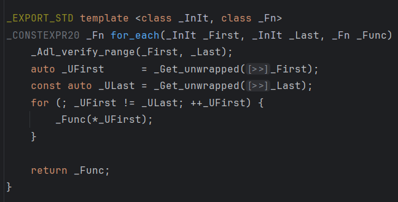

## 问题引入
常常用到各种形式的仿函数调用api，stl是怎么实现这些函数/类的
```cpp
// sort， for_each的实现是怎样的
std::sort(nums.begin(), nums.end(), [](int a, int b){return a > b;});

std::for_each(nums.begin(), nums.end(), [](int& item){});

// 需要定义Vec3的bool运算和std::hash<Vec3>()(const Vec3&)
std:: nordered_map<Vec3, int, std::hash<Vec3>, std::equal_to<Vec3>> mp; 

// 为什么这里的std::greater<int>可以写成std::greater<>
std::priority_queue<int, std::vector<int>, std::greater<int>> q; 

// 为什么这里既可以通过重载Vec3的operator<, 又可以通过创建一个重载了operator()(Vec3, Vec3)的cmp类， 但是不能把cmp写成lambda
std::priority_queue<Vec3> q; 
```
还有就是std::function是怎么对各种形式的仿函数进行封装的，又有什么优点？std::bind是干什么的？
<!--truncate-->
## c函数指针
函数指针的声明格式
`typedef void(*AttackFunc)(Hero&)`, 星号和函数名作为一个整体加括号，前面写返回值，后面写参数。

函数作为一等公民可以方便的实现策略模式（Stragegy Pattern）, 使得某个函数的具体实现方式可插拔，可写在其他地方，可写进配置文件等等。
```cpp
struct Hero{
    int hp = 10;
};

typedef void (*AttackFunc)(Hero&);

void Tick(Hero& hero, AttackFunc func){
    func(hero);
}

void AttackSword(Hero& hero){
    hero.hp -= 1;
}

void AttackGun(Hero& hero){
    hero.hp -= 5;
}


int main(){
    Hero hero;
    Tick(hero, AttackGun);
    Tick(hero, AttackSword);
}

```

这种方式有两个缺点：

* 无法传递额外参数（捕获局部变量）
* 得声明成全局函数，无法就地定义

c语言通过void*类型擦除可以解决第一个问题
```cpp
void Tick(Hero& hero, AttackFunc func, int val){
    func(hero, &val);
}

void AttackSword(Hero& hero, void* value){
    hero.hp -= *static_cast<int*>(value);
}

void AttackGun(Hero& hero, void* value){
    hero.hp -= *static_cast<int*>(value) * 2;
}


int main(){
    Hero hero;
    int BaseDamage = 1;
    Tick(hero, AttackGun, BaseDamage);
    Tick(hero, AttackSword, BaseDamage);
}
```
如果需要捕获更多的局部参数就得使用一个结构体，把void*转型成结构体指针


## 仿函数和lambda
首先我们知道functor和lambda本质上是一样的，用[cppinsight](https://cppinsights.io/)可以看到编译器背后生成的代码（这个也可以用来调试模板元，神器！）
仿函数重载operator()是建议加const的，因为调用者一般喜欢`const AttackFunc& func`这种形式传入，只能执行const方法。


```cpp
struct Hero{
    int hp = 10;
};

struct AttackFunctorSword{
    void operator()(Hero& hero) const {
        hero.hp -= value; 
    };
    int value = 1;
};

struct AttackFunctorGun{
    void operator()(Hero& hero) const{
        hero.hp -= value;
    };
    int value = 1;
};

template <typename AttackFunc>
void Tick(Hero& hero, const AttackFunc& func){
    func(hero);
}


int main(){
    Hero hero;
    int BaseDamage = 1;
    
    AttackFunctorGun gunFunctor; 
    gunFunctor.value = BaseDamage;

    AttackFunctorSword swordFunctor; 
    swordFunctor.value = BaseDamage;

    Tick(hero, gunFunctor);
    Tick(hero, swordFunctor);
}

```

其实lambda里的operator()也是默认加const的, 因此对于需要修改变量值的情况有两种写法
```cpp
// 1. 引用捕获
int a = 1;
auto f = [&a](){
    a = 2;
}

// 2. mutable ， mutable会把默认加的const给去掉
int a = 1;
auto f [a]() mutable {
    a = 2;
}
```

## std::function
仿函数和模板的缺点在于，得用模板的形式来实现strategy这种静态多态。而模板的缺点：
1. 不能做到头文件分离（即使分离也得显示实例化，非常滴麻烦）
2. 我有n个具体的AttackFunctor就需要编译后实例化n次，导致内存占用增加

因此std::function横空出世
```cpp
void Tick(Hero& hero, const std::function<void(Hero&)>& func){
    func(hero);
}
int main(){
    Hero hero;
    int BaseDamage = 1;

    std::function<void(Hero&)> GunFunc = [BaseDamage](Hero& h){
        h.hp -= BaseDamage * 2;
    };
    std::function<void(Hero&)> SwordFunc = [BaseDamage](Hero& h){
        h.hp -= BaseDamage;
    };
    Tick(hero, GunFunc);
    Tick(hero, SwordFunc);
}
```

那么std::function是怎么实现可以同时warp functor、lambda和函数指针的呢 ==> 类型擦除

首先明确一下需要支持的功能
```cpp
Function<int(int)> function_1([](int x){ return x + 1;});
Function<int(int)> function_2 = &FuncPtr;
int a = 1;
std::cout << function(a) << function_2(a);
```

实现一个初版
```cpp
template<typename Ret, typename ... Args>
struct Function<Ret(Args...)>{

};
```
模板参数有了，但是怎么实现传入的函数参数呢，这个函数参数需要同时支持函数指针和带有operator()的结构体/lambda。既然要把这三种传入类型warp起来，自然就要有个warp类, 下面的这个FuncBase就是warp类，因为Warp类需要支持调用任意参数和返回值的operator(), 所以写在Function内部，可以使用Function的模板参数
```cpp
template<typename Ret, typename ... Args>
struct Function<Ret(Args...)>{
    template<typename F>
    struct FunctionBase{
        Ret Call(Args... args){
            return std::invoke(m_f, std::forward<Args>(args)...);
        }
        F m_f;
    };

    std::shared_ptr<FunctionBase> m_f;
};
```
这样显然过不了编译，因为FunctionBase依赖于模板参数F，因此我们需要把这个参数F擦除掉
```cpp
template<typename Ret, typename ... Args>
struct Function<Ret(Args...)>{

    struct FunctionBase{
        virtual Ret Call(Args... args) = 0;
        virtual ~FunctionBase() = default;
    };

    template<typename F>
    struct FunctionImpl : public FunctionBase {
        Ret Call(Args... args) override {
            return std::invoke(m_f, std::forward<Args>(args)...);
        }
        F m_f;
    };


    std::shared_ptr<FunctionBase> m_f;
};
```
通过一个不带模板参数的基类就可以实现类型的擦除，定义出这样的成员变量`std::shared_ptr<FunctionBase> m_f;`
最后补全拷贝构造
```cpp
template<typename Ret, typename ... Args>
struct Function<Ret(Args...)>{
    struct FunctionBase{
        virtual Ret Call(Args... args) = 0;
        virtual ~FunctionBase() = default;
    };

    template<typename F>
    struct FunctionImpl : public FunctionBase {
        FunctionImpl(F f)
            :m_f(std::move(f)){}

        Ret Call(Args... args) override {
            return std::invoke(m_f, std::forward<Args>(args)...);
        }
        F m_f;
    };

    Function() = default;

    template<typename F>
    Function(F f)
        : m_base(std::make_shared<FunctionImpl<F>>(std::move(f)))
    {}

    // Function operator= (const Function&) = delete;
    Ret operator()(Args... args) const {
        return m_base->Call(std::forward<Args>(args)...);
    }
    std::shared_ptr<FunctionBase> m_base;
};
```
## 在std::for_each中看lambda和std::bind
### std::for_each
```cpp
std::vector<int> vec= {1, 2, 3};
std::for_each(vec.begin(), vec.end(), [](int& item) {
    item += 1;
});
std::for_each(vec.begin(), vec.end(), [](int item) {
    std::cout << item;
});
```
我们发现这里的lambda中的参数既可以int也可以int&，这是为什么呢,点进去看实现

可以看到就是普通的模板类，里面调用`_Func(*_UFirst)`, _UFirst是迭代器类型，相当于指针，那么`*_UFirst`在这里就是int，相当于给_func(int)和_func(int&)传参,前者不会修改传入的参数，后者会修改传入的参数，自然两种都可以。

这里也可以看出lambda的一个优势，下面两种第一个编译不通过，第二个借助捕获可以编译通过
```cpp
std::for_each(vec.begin(), vec.end(), [](int& item, int inc) {
        item += inc;
});

int inc;
std::for_each(vec.begin(), vec.end(), [inc](int& item) {
        item += inc;
});
```

### lambda和std::bind
当我现在有两个函数，他们都是别人写的不能修改定义，比如
```cpp
// 函数1
void Increment(int &val, int inc) {
    val += inc;
}

// 函数2
std::for_each(_, _, OP);
```
Op的参数个数小于Increment个数时，可以用lambda或bind来实现，lambda的存在让bind有点意义不大了
```cpp
std::vector<int> data = {1, 2, 3};
int inc = 5;

    // std::bind
    auto my_inc = std::bind(Increment, inc, std::placeholders::_1);
    std::for_each(data.begin(), data.end(), my_inc);

    // lambda
    std::for_each(data.begin(), data.end(), [inc](int& item) {
        Increment(item, inc);
    });

// Op参数大于Increment
```