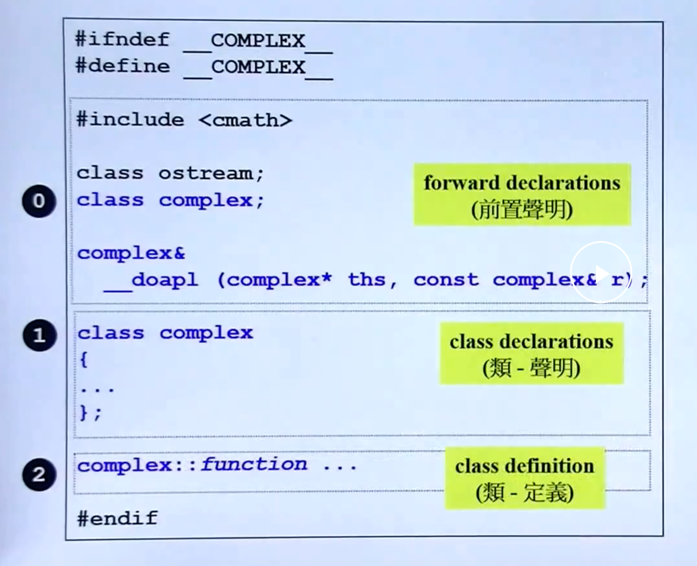
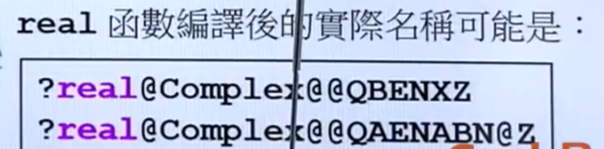
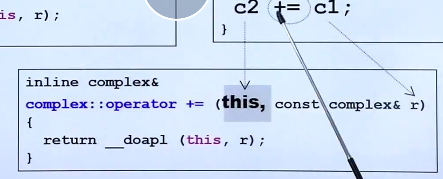
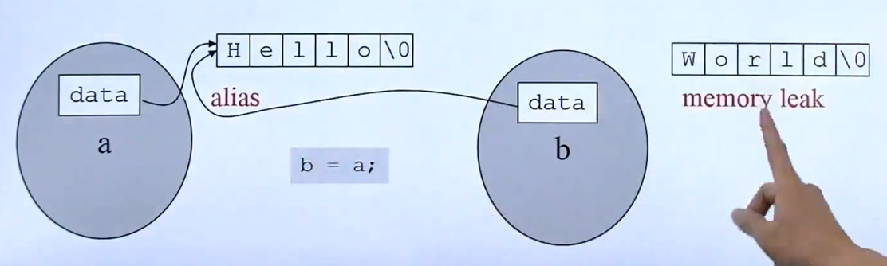
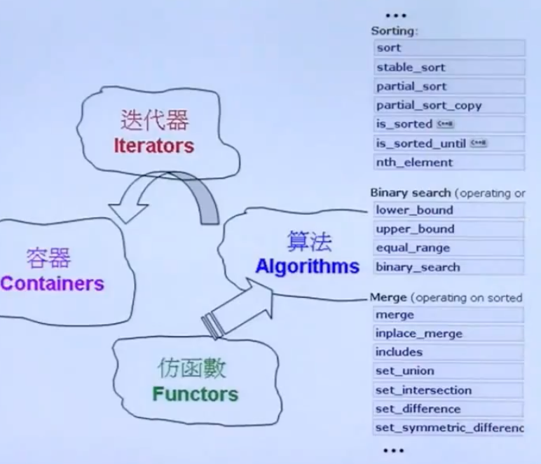

<!--truncate-->

## 头文件总体布局



guard（防卫式声明）

只有第一次include会include进来，第二次不会被include进来

```
#ifndef __Complex__
#define __Complex__
...


#endif
```

定义一个复数

```cpp
class complex{
  public:
  complex(double r = 0,double i = 0): re(r)	,im(i){}
   ...
  private:
  double re,im;
}

complex c1(0,0.5)
```

缺点：如果想把double改为float就得重新定义一个类

===> template(模版)

```cpp
template<typename T>
class complex{
  public:
  complex(T r = 0,T i = 0): re(r)	,im(i){}
   ...
  private:
  T re,im;
}

complex<double> c1(0,0.5)
complex<float> c1(0,0.5)
```


**Inline(内联)**

程序员设计是否inline只是给编译器建议，编译器最终是否inline取决于函数是否复杂。

```cpp
class complex{
  public:
  complex(double r = 0,double i = 0): re(r)	,im(i){}
  
  // 在class本体里直接定义的函数会自动inline
  double real() const	{return re;} // inline function
  double img() const;// declaration
  private:
  double re,im;
}

// class本体内声明了的，而本体外想要建议编译器inline需要加inline关键词
inline double img(const complex& x){
  return x.img();
}

void real(double r){real = r;}
```


**构造函数**

```cpp
class complex{
  public:
  // （1）最好写成这样，直接初始化 r和i
  complex(double r = 0,double i = 0): // =0为默认参数
  re(r)	,im(i) // 初始列
  {}   // 赋值
  // （2）而最好不要写成这样，先初始化， 再赋值r和i
  complex(double r = 0,double i = 0) {re = r; im = i};
  
  // 在class本体里直接定义的函数会自动inline
  double real() const	{return re;} // inline function
  double img() const;// declaration
  private:
  double re,im;
}

{
  complex c1(1,2);  //1+2i
  complex c1;  // 0 + 0i
  complex *p = new complex(4);
}
```

可以把构造函数放在private，表示该类对象不能被其他类创建，但是可以使用友元来创建。

应用：singleton(单例)设计模式

```cpp
class A{
public:
  static A& getInstance();
  setup(){...};
private:
  A();
  A(const A& rhs);
  ...
}

A& A::getInstance(){
  static A a;
  return a;
}

A::getInstance().setup();
```


**Overload(重载)**

同名函数，不同参数列表或返回值。

能重载的原因是，编译后不同参数返回值的同名函数在编译器看来名字并不一样




```cpp
class complex{
  public:
  // 1
  complex(double r = 0,double i = 0): re(r)	,im(i){}
  // 2
  complex():re(0),im(0){}
  // 1、2不能同时出现，因为1有默认值
  
  // 3
  double real() const	{return re;} // inline function
  double img() const;// declaration
  private:
  double re,im;
}

// 4
void real(double r){real = r;}
// 3、4可以同时出现
```


==const member function （常量成员函数）==

```cpp
double real() const{
	return re;
}
```


* const用在成员函数表示“不会改变类对象数据内容的成员函数”
* const int/double/complex 表示常量，不会发生变化的量

下面这种情况，const member function的const不可省略，否则编译不通过.

```cpp
double real() const{
	return re;
}

{
  const complex c(2,1);
  cout << c1.real();
}
```

==const 对象 只能调用 有const的成员变量==

* 类中某个函数加了const，这时候其他人定义的无论是const的对象还是非const的对象，都可以调用这个函数
* 但某个函数没有加const（即成员变量可以被修改），这时候其他人定义了一个const的对象，就无法再调用这个可以修改成员变量的函数了。

因此类设计者要应const尽const。


## 参数传递/返回值传递

* pass by Value
* pass by Reference
* pass by Reference Const

尽量不要pass by Value

引用在底层其实就是指针

Reference Const就是传递引用，但是函数不能对这个引用进行修改，否则编译会出错


* return  by Value

* return by Reference

  比较这两种方式

  （1）

  ```cpp
  inline complex& __doapl(complex *ths, const complex &r){// doapl == do assignment plus
    ths->re += r.re;
    ths->im += r.im;
    return *ths; // ths是个指针， *ths是指针指向的对象，返回一个对象的引用
  }
  
  // 此时，别人调用这个函数
  complex c3;
  c3 = __doapl(&c1, c2); // 等号前面的c3不用思索就能直接写了
  ```

  （2）

  ```cpp
  inline complex __doapl(complex *ths, const complex &r){// doapl == do assignment plus
    ths->re += r.re;
    ths->im += r.im;
    return *ths;
  }
  complex c3;
  c3 = __doapl(&c1, c2);
  
  
  inline complex __doapl(complex *ths, const complex &r){// doapl == do assignment plus
    ths->re += r.re;
    ths->im += r.im;
    return *ths;
  }
  complex *c3 = new complex();
  *c3 = __doapl(&c1, c2);
  
  // 调用者需要思考一下是写 c3 还是 *c3
  ```

  调用该函数的人不用知道传递的东西是什么形式的（by reference或by value）

* return by Reference Const

如果可以的话尽量返回reference，为了更快。

不能返回reference的情况：需要返回一个新创建的对象，而不能用已有的代替，因为在函数结束时，新创建的对象也没了！

## friend友元

声明一个friend函数，可以不经过public方法，直接获得类对象的private数据。

```cpp
class complex{
  public:
  complex(double r = 0,double i = 0): re(r)	,im(i){}·
  
  double real() const	{return re;} // inline function
  double img() const;// declaration
  private:
  double re,im;
  
  // 声明友元
  friend complex& __doapl(complex*, const complex&);
}

inline complex& __doapl(complex* ths,const complex& r){
  ths->re += r.re;
  ths->im += r.im;
  return *ths;
}


```


**相同class的各个Objects互为友元**

```cpp
class complex{
  public:
  complex(double r = 0,double i = 0): re(r)	,im(i){}
  
 int func(const complex& param){
   return param.re;
 }
  private:
  double re,im;
}

{
  complex c1(2,1);
  commplex c2;
  c2.func(c1);
}
```


## 操作符重载和临时对象

c++里操作符也是一种函数，可以重新定义的

### 类内部的操作符重载

```cpp
inline complex& __doapl(complex *ths, const complex &r){// doapl == do assignment plus
  ths->re += r.re;
  ths->im += r.im;
  return *ths;
}

// 1
inline complex& += (const complex &r){
  return __doapl(this, r);
}

// 2  是错的 this不能写出来 他是被编译器处理之后的结果（下图是示意图）
//    编译器处理后的this可能是第一个参数，也可能是最后一个参数，取决于不同的编译器
inline complex& += (this, const complex &r){
  return __doapl(this, r);
}


```

>  编译器看待“c2 += c1”
>
>  += (c2, c1)
>
>  +=是一个函数




**this**

所有的成员函数都含有一个隐藏的参数： this， 可以把它写出来。

谁调用这个函数，谁就是那个this。

this是个指针，指向调用函数的对象


> 为什么要设计成有返回值 而不是void： 为了 c1 += c2 += c3
>
> 从后往前： c2 += c3 然后 c1 += c2


### 类外的操作符重载

```cpp
c2 = c1 + c2
c2 = 7 + c1
//多种加法，所以不能在类里面重载
```


```cpp
inline complex operator + (const complex &x, const complex &y){
  return complex(x.real()+y.real(), x.img()+y.img());
}

inline complex operator + (int x, const complex &y){
  return complex(x + y.real(), x.img()+y.img());
}
```

==绝不能返回引用， 因为函数体内创建的临时对象会在函数结束后清空==


```cpp
cout << c1;
// 这里的<<只能写成非成员操作符重载，因为cout这个对象改不了
```

```cpp
#include <iostream>

ostream&
operator << (ostream &os, const complex &x){
  return os << real(x) << " " << img(x);
}

// 为了解决一连串的情况，所以不能设置成void返回值
cout << c1 << c2;
// 这个是从左往右的 cout << c1 再 << c2
```

上述返回值可以用&（不是临时对象）， 不能加const（为了连续输出）

### 临时对象

```cpp
complex(a, b) 
complex()
int(7)
```

这样的写法就是创建临时对象， 它的生命在下一行就结束了

需要在本行就进行其他操作，比如

```cpp
return complex()
std::cout << complex()
auto a = complex()
```

## ==设计一个class应该注意的事情==

1. 善用构造函数的initilization list
2. 成员函数加不加const， 应加尽加，否则会有副作用
3. 参数、返回值传递尽量pass by reference、return by reference，考虑能不能用reference（临时变量）
4. 数据尽可能放在private


## BigThree：拷贝构造、拷贝函数、析构

```cpp
// 设计一个string.h
#ifndef __MYSTRING__
#define __MYSTRING__

class string{
  
}
#endif

// 能够实现下列操作

string s1();
string s1("hello");
string s3(s1); // 拷贝构造

cout << s3 << endl;
s3 = s2; // 拷贝复制
cout << s3 << endl;
```

如果没有写拷贝构造和拷贝复制，编译器会自动给写一份，它的实现是一个byte一个byte的去复制。

如果一个类里面有一个指针，就需要自己去实现拷贝，否则编译器默认的拷贝会把拷贝过去的指针指向同一个地方，而不是开一个新空间。


```cpp

class String{
  String(const char* cstr = 0); // ascii 0 is null
  String(const String &str); // 拷贝构造
  String& operator = (const String &str); // 拷贝函数
  ~String(); // 析构
  char* get_c_str() const {return m_data};
 
  private:
  	char* m_data; // 可以动态增长，用指针
}
```


```cpp
String::String(const char* cstr = 0){
  if(cstr){
    m_data = new char[strlen(cstr) + 1];
    strcpy(m_data, cstr);
  }else{
    m_data = new char[1];
    *m_data = '\0';
  }
}

String::~String(){
  delete[] m_data;
}

{
  string s1();
	string s2("hello");
  string *p = new string("hello");
  delete p;
  
  // 前两个生命周期结束时（离开作用域）会自动调用析构函数
  // 最后一个得手动delete
}

```


浅拷贝（不拷贝值）

根据编译器默认的拷贝实现方式（一个bit一个bit拷贝），这种写法会造成内存泄漏

开了一块内存，但没有指针指着（再也不能管理到这块内存了）




深拷贝

```cpp
string::string(const string &str){
  m_data = new char[strlen(str.m_data) + 1]; // 相同class的各个Objects互为友元
  strcpy(m_data, str.m_data);
}

string s1("hello");
string s2(s1);
```


```cpp
string& string::operator=(const string& str){
  // 先清空
  if(this == &str) return *this;// 检测自我赋值 不写的话如果自我赋值会出错
  delete[] m_data; 
  // 开空间
  m_data = new char[strlen(str.m_data) + 1];
  // 赋值
  strcpy(m_data, str.m_data);
  return *this;
}
```

==Array new一定要搭配Array Delete==


```cpp
ostream& operator<<(ostream &os, const string &str){
  os << str.get_c_str();
  return os;
}
```


## 堆、栈、内存管理

栈：stack，存在于一个作用域的一块内存空间

堆：heap， 操作系统提供的全局的内存空间

```cpp
{
  Complex c1(1,2); // stack  离开作用域时生命自动消失（调用析构函数）
  static Complex c2(1,2); // 离开作用域时生命还会存在
  Complex *p = new Complex(3); // heap 离开作用域时需要手动释放，否则会一直存在
}
```


```cpp
{
Complex *p = new Complex;
...
delete p; //一定要delete或者传出去
}
```

new 的时候内部是 malloc、转型、构造函数

delete的时候内部是析构函数和释放内存

> 对于String来说 析构函数清空data的内存、然后编译器再删除String类内的char *指针

new的时候会分配很多额外的空间，比如8字节的complex，实际能分配64（debug mode）/ 16（release mode）字节，包括三或四个部分

上下cookie（记录分配出去的大小）、类内容、debug额外所需部分、padding。


**动态分配数组**

```cpp
String *p = new String[3];
delete[] p; // 调用三次析构函数

String *p = new String[3];
delete p; // 调用一次析构函数（在string这种动态分配的class的情况下会引起内存泄漏 ）
```


## 转换函数

```cpp
class Fraction{
  public: 
  ...
    // non-explicit-one-argument ctor
    Fraction(int num, int den = 1):m_numerator(num),m_denominator(den){}
  
    operator double() const{ // 转换函数一般都会加const
    return (double) const(m_numerator / m_denominator);
  }  
 private:
    int m_numerator;
    int m_denominator;
  }
}

Fraction f(3,5);
double d = 4 + f;
// 编译器处理：
// 1. 找有没有全局的operator +(int, Fraction)
// 2. 找转换函数，f能不能转为double
```


```cpp
class Fraction{
  public: 
  ...
    // non-explicit-one-argument ctor
    Fraction(int num, int den = 1):m_numerator(num),m_denominator(den){}
  }  
 private:
    int m_numerator;
    int m_denominator;
  }
}

Fraction d2 = f + 4;
// 编译器处理：
// non-explicit-one-argument ctor: 将4转化为fraction
```


两种方法写一起可能造成编译器矛盾

```cpp
class Fraction{
  public: 
  ...
    // non-explicit-one-argument ctor
    Fraction(int num, int den = 1):m_numerator(num),m_denominator(den){}
  
    operator double() const{ // 转换函数一般都会加const
    return (double) const(m_numerator / m_denominator);
  }  
 private:
    int m_numerator;
    int m_denominator;
  }
}

Fraction f(3,5);
Fraction d = 4 + f;
// 把f转为double 还是 把4转为fraction
```

解决==> explicit

表示构造函数只有显示的写的时候才能做，而不能隐式转化

```cpp
explicit Fraction(int num, int den = 1):m_numerator(num),m_denominator(den){}
```

## 类指针类（Pointer-like Class） shared_ptr和iterator

```cpp
templete<class T>
class shared_ptr{
  public:
  T& operator*() const{return *px} // 定义 *A 取指针对应内容的操作
  
  T* operator->() const{return px}; // -> 操作符 会作用在他前面的那个变量上，返回值是T*
  
  shared_ptr(T *p):px(p){}
  private:
  T* px;
  long *pn;
}

struct Foo{
  void method(){...}
}

sp = shared_ptr<Foo> (new Foo());
Foo f(*sp);
sp->method();
// ==>  箭头作用在sp上，转化为 px->method();
// ==> 箭头符号的特殊性， 会继续执行下去， 而不像其他符号执行一次就停止
```

```cpp
templete<class T>
struct __list_node{
  void* prev;
  void *next;
  T data;
}

templete<class T,class Ref, class ptr>
struct __list_iterator{
  typedef __list_node<T>* link_type;
  link_type node;
  
  ref operator*() const{ return (*node).data};
  ptr operator->() const {return &(operator*())};
}


list<Foo> iter;
iter->method();
// ===> &(*iter)->method


```

## 类函数类（function-like class）

```cpp
templete<class T1, class T2>
struct pair{
  T1 first;
  T2 second;
  pair():first(T1()),second(T2()){}
  pair(const &t1, const &t2):first(t1),second(t2){}
}


temple<class Pair>
struct select1st{
  const typename  Pair::first_type& operator()(const Pair &x) const{
    {return x.first};
  }
}
```

## 模版 template

只有这个位置 typename等价于class

#### 模版 类

```cpp
temple <class T> // 或 temple <typename T>
class complex{
  public:
  	complex(T r = 0, T i = 0):re(r), im(i){}
}
complex<int>  c1(2, 1);


```

#### 模版 函数

```cpp
templete<class T>
inline const T& min(const T &a, const T &b	){
  return b < a ? b : a;
}
```

模版在的文件会先编译一次，不会有什么问题；

之后还会和其他文件一起再编译一次，如果该类型T，没有重载 < 还是会报错。

#### 模版 成员

```cpp
templete <class T1, class T2>

struct pair{
  T1 first;
  T2 second;
  pair(const &T1 a, const &T2 b):first(a),second(b){};
  
  templete<class U1, class U2>
  pair(const pair<U1,U2> &p) first(p.first),second(p.second){}
}


class Derived1: public Base1{
  
}

class Derived2: public Base2{
  
}

pair<Derived1, Derived2> p;
pair<Base1, Base2> p2(p);
```


#### 模版特化

特化 <--> 泛化

**全特化**

```cpp
templete <class key>
struct hash { };

// 特化，某些指定类型时特殊处理
templete <>
struct 	hash<char>{
  size_t operator()(char x) const {return x};
}

struct 	hash<int>{
  size_t operator()(int x) const {return x};
}

struct 	hash<long>{
  size_t operator()(long	 x) const {return x};
}

// 特化 specialization
cout << hash<long>()(1000);
```

**偏特化**

（1）个数上的偏

```cpp
templete<typename T, typename Alloc=...>
class vector{
  
};

templete<typename T, typename Alloc=...>
class vector<bool, Alloc>{
  
}
```


(2) 范围上的偏

```cpp
templete <typename T>
class C{
  
}

templete <typename U>
class C<U*>{
  ...
}

//
C<string> c1;
C<string*> c2;
```


#### 模版套模版

```cpp
templete<typename T, templete <typename T>
                     class Container>
class XCLs{
  private Container<T> c;
}

XCLs<string, list> mylst;

```


## C++标准库

### Containers（容器）

1. **Sequence**：array， vector， deque， forwar_list， list
2. **container adaptors**: stack, queue, priority_queue
3. **associate** : set, multiset, map, multimap
4. **unordered associate**: unordered_set, unordered_multiset, unordered_map, unordered_multimap





