<!--truncate-->

## 代码实现过程记录

具体代码见https://github.com/CanoeByGuitar/chenhui-lib

### 光线和各种物体求交


### Lambertian Shading

```cpp
// light
vec3 light_pos(0,4,-2);
    float intensity = 1.f;
    Light light(light_pos, intensity);
```

```cpp
// World
    Material *m = new Material(vec3(100, 100, 100));
    SurfaceList world(nullptr);
    world.add(std::make_shared<Circle>(Circle(m, vec3(0, 0, -1), 0.5)));
    world.add(std::make_shared<Circle>(Circle(m, vec3(0, -100.5, -1), 100)));
```


```cpp
vec3 ray_color(SurfaceList &world, Ray r, Light light){
    Intersection inter1;
    vec3 color(0, 0, 0);
    if(world.getIntersect(r, 0.f, INF, inter1)){
        auto p = inter1.point;
        auto n = inter1.normal;
        auto light_ray = Ray(p, light.pos - p);
        auto l = light_ray.direction();
        auto k_d = inter1.m->k_d;
        Intersection inter2;
        if(world.getIntersect(light_ray, 0.f, INF, inter2)){
            // light cannot arrive at obj
        }else{
            auto I = light.intensity;
            color += k_d * max(n * l, 0.f) * I;
        }
    }
    return color;
}
```


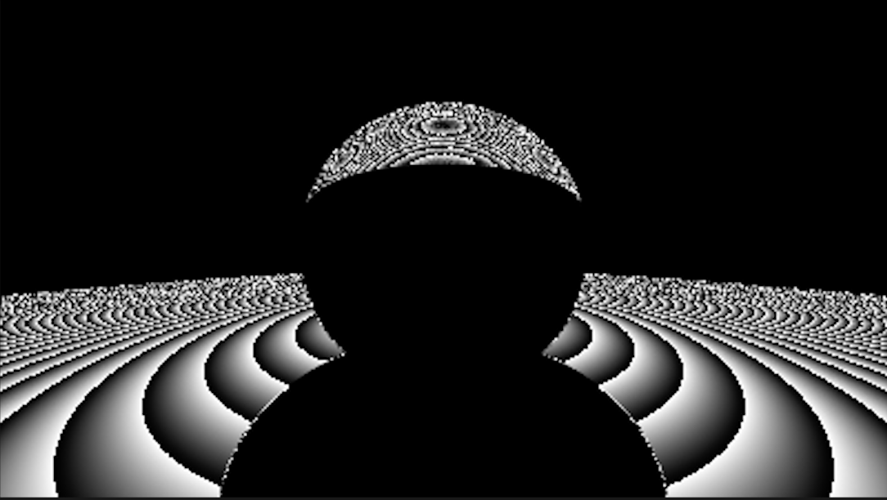


检查代码 材质里的k_d应该是[0,1]区间而不是[0,255]

```cpp
Material *m = new Material(vec3(0.7f, 0.7f, 0.7f));
```

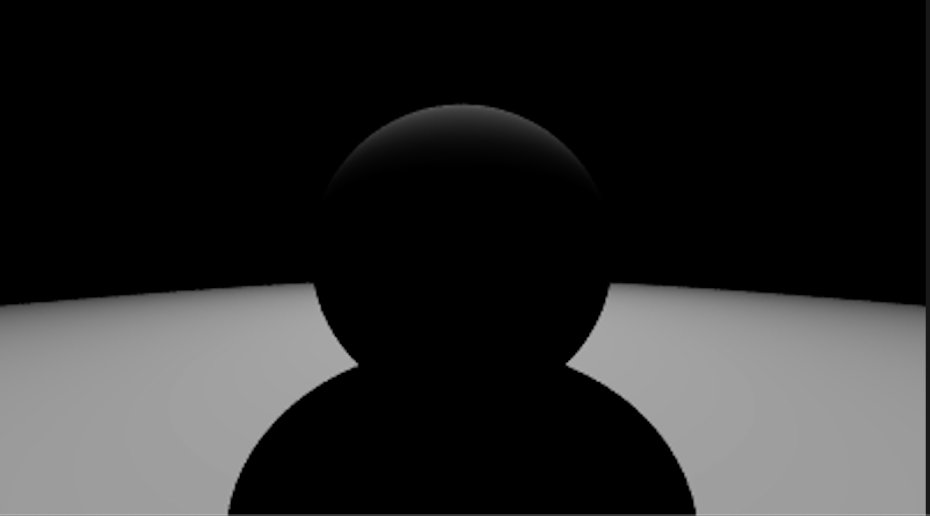


### Blinn-Phong Shading

给输出color加了一个clamp，超过1的输出1，否则ppm会被大于255的数解析成黑的

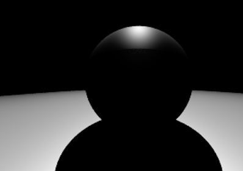


下图的参数为：

```cpp
// World
    auto *m1 = new Material(vec3(1, 0, 0), vec3(1, 0, 0), vec3(1, 0, 0));
    auto *m2 = new Material(vec3(0, 1, 0), vec3(0, 1, 0), vec3(0, 1, 0));
    auto *m3 = new Material(vec3(0.25, 0.25, 0.25), vec3(0.25, 0.25, 0.25), vec3(0.25, 0.25, 0.25));
    SurfaceList world(nullptr);
    world.add(std::make_shared<Circle>(Circle(m1, vec3(0.42, -0.08, -1.5), 0.4)));
    world.add(std::make_shared<Circle>(Circle(m2, vec3(-0.35, -0.1, -1.3), 0.35)));
    world.add(std::make_shared<Circle>(Circle(m3, vec3(0, -100.5, -1), 100)));

    // light
    std::vector<Light> light_list;
    light_list.emplace_back(vec3(-4, 4, -3), 0.2f);
    light_list.emplace_back(vec3(4, 4, -3), 0.5f);
    light_list.emplace_back(vec3(0, 6, 0), 0.3f);
```

```cpp
vec3 ray_color(SurfaceList &world, Ray r, const std::vector<Light> &light_list) {
    Intersection inter1;
    vec3 color(0, 0, 0);
    if (world.getIntersect(r, 0.f, INF, inter1)) {
        auto p = inter1.point;
        auto n = inter1.normal;
        auto v = -r.direction();
        auto k_d = inter1.m->k_d;
        auto k_s = inter1.m->k_s;
        auto k_a = inter1.m->k_a;
        // ambient shading
        float I_a = 0.2;
        color += k_a * I_a;
        for (auto light: light_list) {
            auto light_ray = Ray(p, light.pos - p);
            auto l = light_ray.direction();
            auto h = unit_vec((v + l));
            Intersection inter2;
            if (world.getIntersect(light_ray, 0.f, INF, inter2)) {
                // light cannot arrive at obj
            } else {
                auto I = light.intensity;
                color += k_d * max(n * l, 0.f) * I + k_s * I * pow(max(0.f, n * h), 10);
            }
        }
    }else{
        // background color
        return vec3(0.847, 0.914, 0.996);
    }
    return clamp(color, 0, 1);
}
```

调整下面的p得到不同的材质

```L = k_d* I * max(0,n.dot(l))+ k_s* I  * max(0,n.dot(h))^p // p是为了加速从高光到消失的变化效果的```

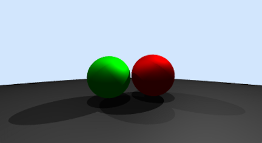

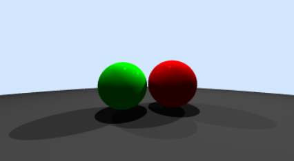

## Math

### 点到直线距离

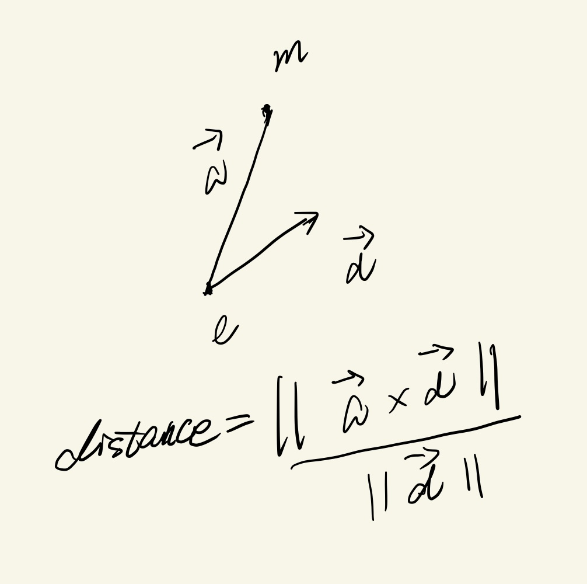


### 计算行列式

LU分解 L下三角 U上三角

### 变换矩阵

首先注意，**正交矩阵包括旋转和镜面反射两种情况**

$A=A^{T}$ 

det(A) == 1 ==> rotation 

det(A) == -1 ==> reflection

任意一个对成矩阵A，都表示沿着某一个方向（x'oy')进行放缩，x'oy'由特征向量组成

==symmetric matrices can be decomposed via eigenvalue diagonalization into a rotation times a scale times the inverse-rotation==

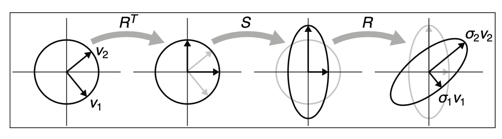

相似对角化$ A =   R  S R^{T} $

旋转 ==> 放缩 ==> 转回来


3D 旋转矩阵

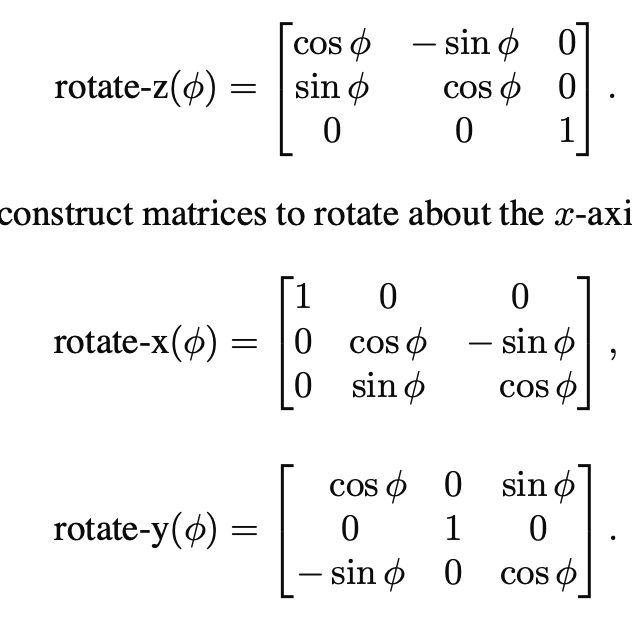

### SVD

singular value decomposition

==every matrix can be decomposed via SVD into a rotation times a scale times another rotation==

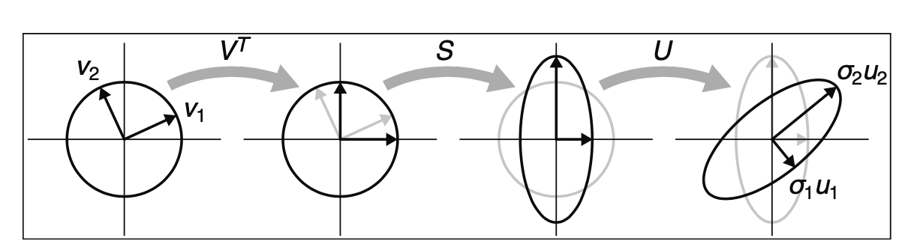


>  如何解决正交矩阵不一定是旋转矩阵的问题？(Dynamic Deformables P181)

**手算SVD分解：**

$A = UBV^T ==> AA^T = UB^TBU^T$

$A = UBV^T ==> A^TA = VB^TBV^T$

对称矩阵正交相似化，求特征值、特征向量, 特征值开根就是B，原则上统一取B为正的。

**极分解**：

任意一个矩阵A可以分解为 $A = R S$

其中R是 正交矩阵， S是对称半正定矩阵

分解过程借助于SVD

$A=UBV^T = (UV^T) (VBV^T)$

令$R = UV^T$, $S = VBV^T$ 

因为U V为正交矩阵，所以$UV^T$也是正交矩阵（乘自己转置为E）

B是对角阵，且正定，所以S对称正定。

**实现**（JacobiSVD）

> https://zhuanlan.zhihu.com/p/459369233
>
> Matrix Computation(2013) p447

* 先算极分解， $A = R S$，得到对称矩阵S
* 对S进行**Jacobi（Givens）旋转对角化**，去掉非主对角的非零元素

$\frac{\partial f(z)}{\partial \Im z}=i \frac{\partial f(z)}{\partial \Re z}$

### 齐次坐标（*homogeneous coordinates*）

点 ==> (x, y, 1)

方向 ==> (x, y, 0)

## Ray tracing

```cpp
for each pixel do
  compute view ray
  find first hit object and its norml n
  set pixel color from hit point, light, normal n
```


### Gen rays

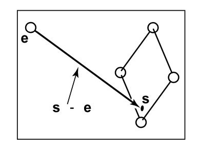


$p(t)=e+(s-e)t$

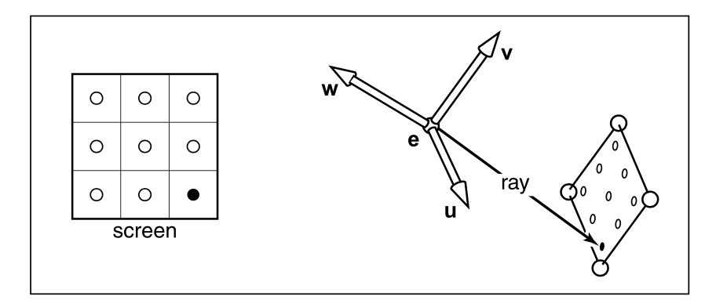

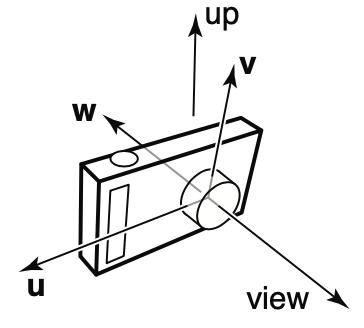

相机的view port是w的反方向（Opengl里也是如此）。

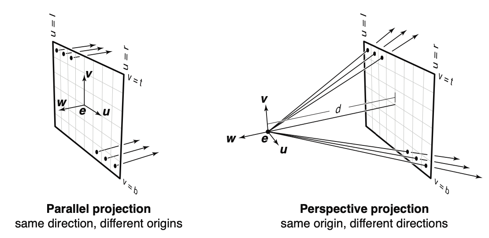

#### Orthographic view

```cpp
// input [l,r,b,t, nx, ny, u, v, w]
// pixel (i,j)  ==> position coordinates
px = l + (r - l) / nx * (i + 0.5)
py = b + (t - b) / ny * (j + 0.5)

ray.direction = -w
ray.origin = e + px * u + py * v
```


#### Perspective Views

```cpp
px = l + (r - l) / nx * (i + 0.5)
py = b + (t - b) / ny * (j + 0.5)

ray.direction = -d * w + px * u + py * v;
ray.origin = e;
```

### Ray-Object intersection

##### Ray-Sphere

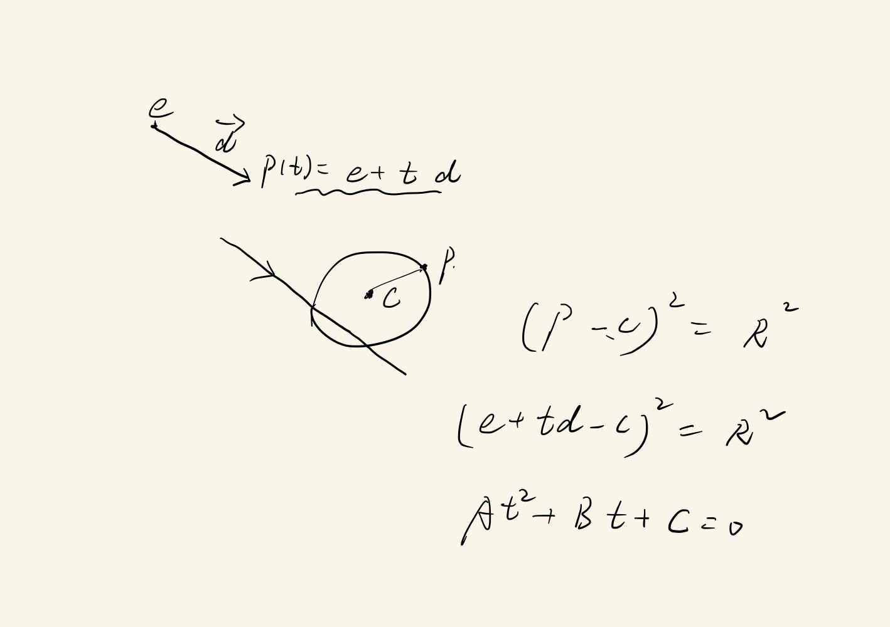

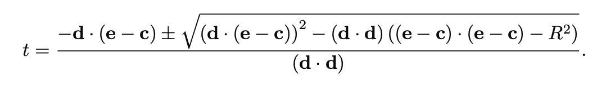

##### Ray-Triangle

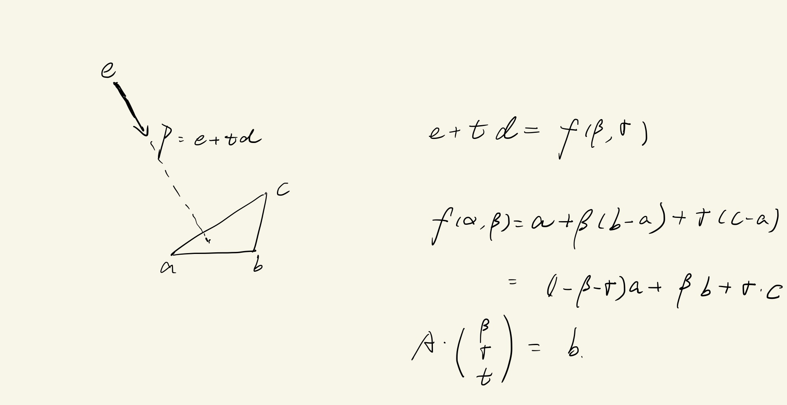

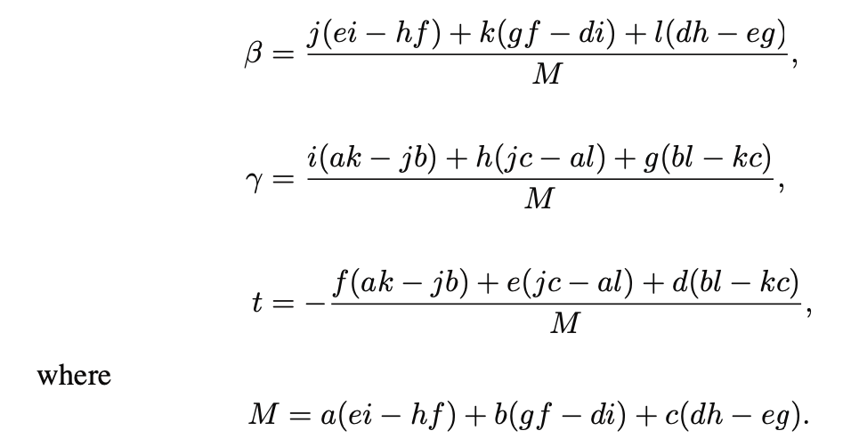

```cpp
// ray-triangle intersection
compute t
if(t < t0 || t > t1) return false;
compute gamma;
if(gamma < 0 || gamma > 1) return false;
compute beta;
if(beta < 0 || beta > 1 - gamma) return false;
return true;
```

##### Ray-Polygon


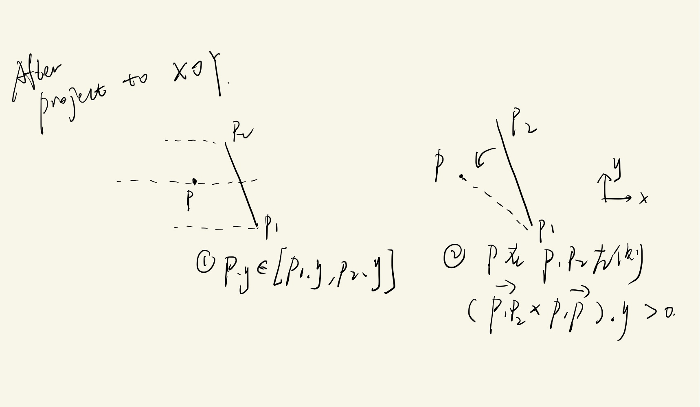

2D判断p在多边形内/外

```cpp
ray from p intersects with polygon boundary
count the hit number h
if(h is odd) return inside
else return outside
```


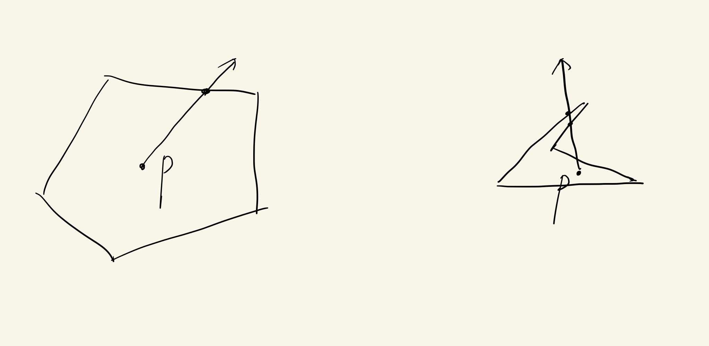

##### A group of Objects

```cpp
// input [t0, t1] ray
intersection{
  bool hit = false
  for(each object o: group){
    if(o intersets ray in t && t >= t0 && t < t1){
      hit = true;
      hit_obj = o;
      t1 = t;
    }
  }
  return hit
}

```


### Shading

important variables: 

* light direction **l**

* view dirction **v**
* 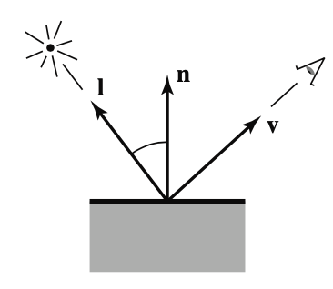

#### Lambertian Shading

落在surface上的光的量只和入射角度相关（view independent 不考虑人眼位置看到的光的不同）

* 垂直的时候 光最多

* 相切的时候 光为0

* 两者之间时，和入射光与face normal的夹角theta成正比。

  ```cpp
  L = k_d * I * max(0, n.dot(l)); 
  
  // k_d: diffuse coef / surface color    3 channels
  // I: light intensity     3 channels
  // n: unit face normal
  // l: unit light dir
  ```

  

#### Blinn-Phong Shading

在Lambertian的基础上额外考虑高光（Phong和Blinn两个人分别完成和改进）

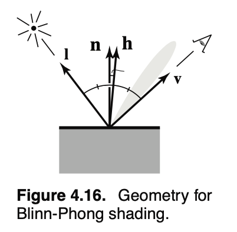

```cpp
h = (v + l).norm()
  // Labert diffusion  + specular
L = k_d* I * max(0,n.dot(l))+ k_s* I  * max(0,n.dot(h))^p // p是为了加速从高光到消失的变化效果的
```

#### Ambient Shading

然而在早期的blinn-phong模型下，没有被光源直接照射的地方就是纯黑的，因为blinn-phong不考虑间接光，所以一个讨巧的方法是，

给surface表面默认附上一个颜色，叫ambient shading

以上三块整体构成blinn-phong模型

```cpp
L = diffusion + specular + ambient(环境光)
L = k_d* I * max(0,n.dot(l))+ k_s* I  * max(0,n.dot(h))^p + k_a * I_a // 可以所有的surface k_a都相同，也可以不一样
```

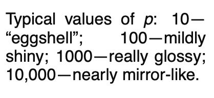

#### Multiple Point Lights

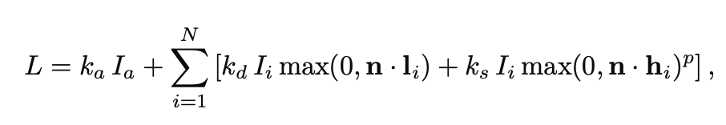

> 疑问：$I$怎么设定, 不会产生过爆吗？


### A ray tracing program

```cpp
for each pixel{
  compute viewing ray r
  if(r hits a object with t in [0, +inf]){
    compute normal n;
    evaluating shading and set color to the pixel
  }else{
    set pixel to background color
  }
}
```

OOP类设计

```cpp
class surface: geometry{
  virtual bool hit(ray r+td, real t0, real t1, hit_record rec);
  virtual box bounding_box()
    
  private material *mtl;
}

class sphere:surface{
  box bounding_box(){
    vec3 min = center - vec3(radius, radius, radius);
    vec3 max = center + vec3(radius, radius, radius);
    return box(min, max);
  }
}
```

### Shadows

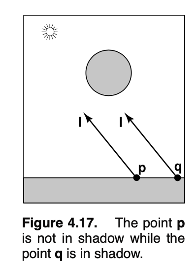

shadow ray（区分与view ray） 用来判断是否在阴影中（如果hit了object，则在阴影中）

```cpp
p+t*l, t in [0,+inf)
             
// 实践中通常为
t in [kesi, +inf] // 防止数值误差导致intersect with p本身在的平面。
```

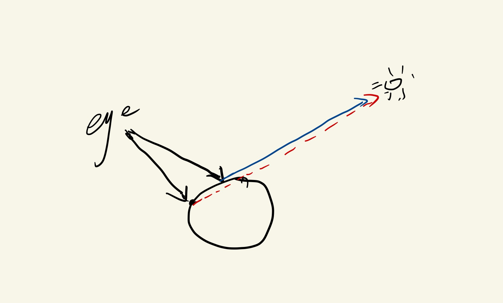

至此，更新ray tracing中计算某个像素颜色的算法

```cpp
raycolor(e+t*d, t0, t1){
  if(hit(e + t*d, t0, t1, &rec)){
    p = e + (hit_record).t * d;
    color c = rec.k_a * I_a; // ambient light
    
    // 判断能否被光源照到
    if(not hit(p + s*l, kesi,inf, &second_record)){
      // 没有阴影
      vec3 h = (l.norm() + (-d).norm()).norm();
      c = c + rec.k_d*I*max(0, n*l) + rec.k_s * I * (n  * h)^(rec.p);
    }else{
      // 有阴影不做其他处理
    }
  }else{
    // 没有看到物体
    return background;
  }
}
```

## Viewing

Object Space   ==>  World Space ==> Camera Space ==> Canonical View Volume$[-1,-1]^2$ ==> Screen Space

  						M							 V								P												viewport transformation


一些别称：

Canonical View Volume： **Clip Space**， Normalized device coordinates（**NDC**）


### Viewport Transformation

$[-1,1]^2 ==> [-0.5, nx-0.5] \times [-0.5,ny-0.5]$

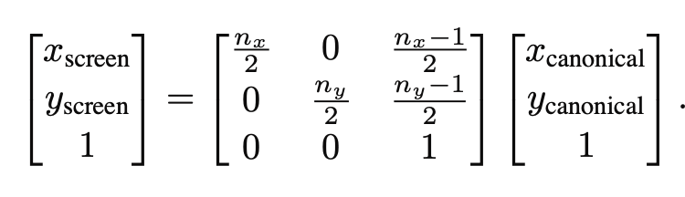

加上z轴，让z保持不变

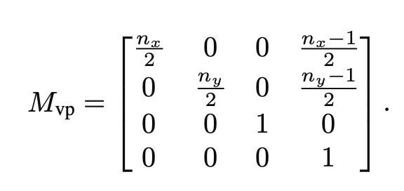

### Projection transformation

#### Orthographic

 $[l, r] × [b, t] × [f, n] ==> [-1,1]^3$

前者取决于用户设定

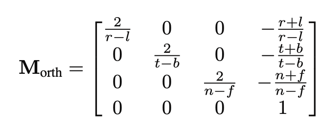

e.g:

n = -0.01

f = -150

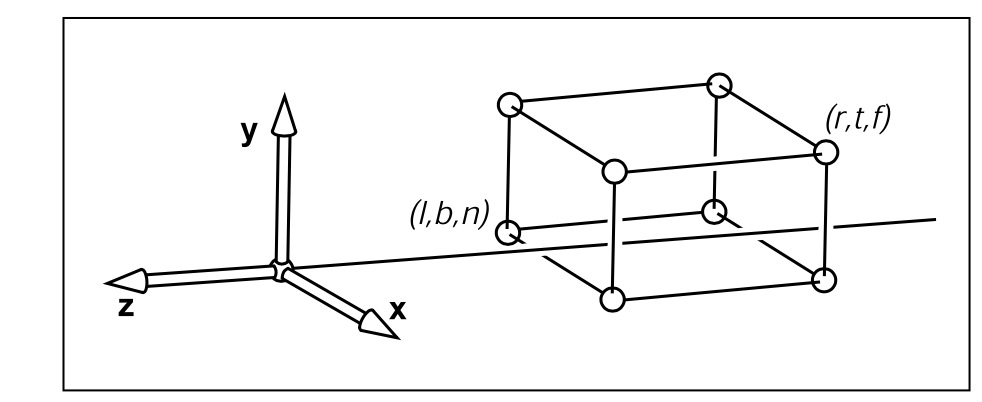

#### Projective


### View（Camera） transformation

**world space[x,y,z]  ===> camera space[u, v, w]**

[u, v, w] can be generated from camera info：

* eye position: **e**
* gaze direction: **g**
* view-up vector: **t** 只是把观察者的头部分成左右两个部分

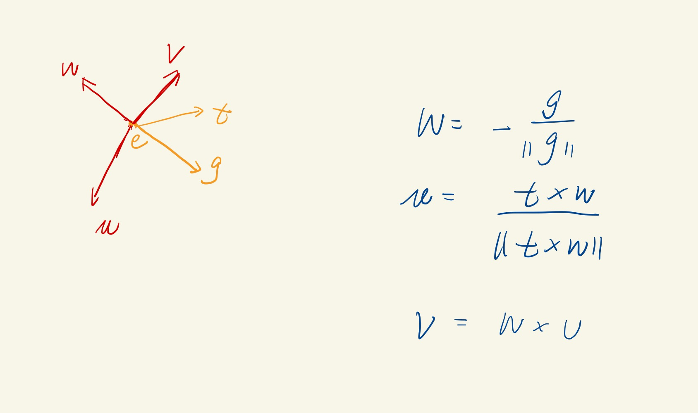


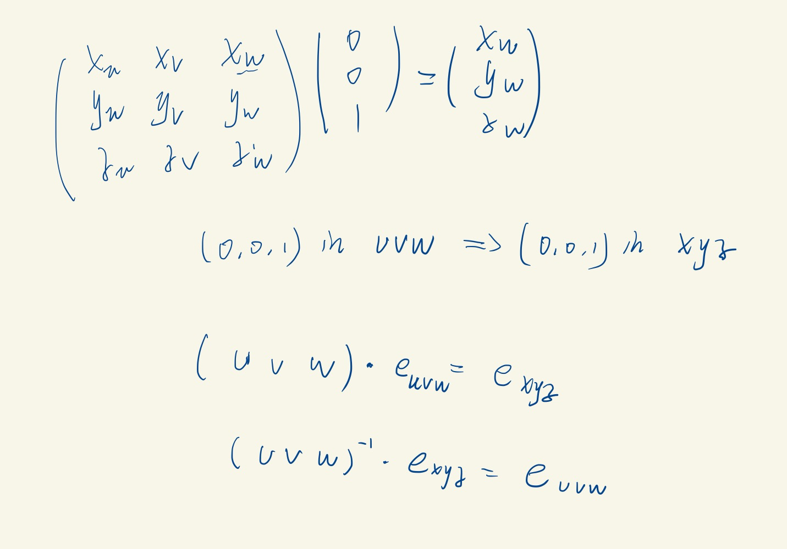


可以理解成先移动-e到原点再旋转

$M = M_{vp}M_{orth}M_{cam}$