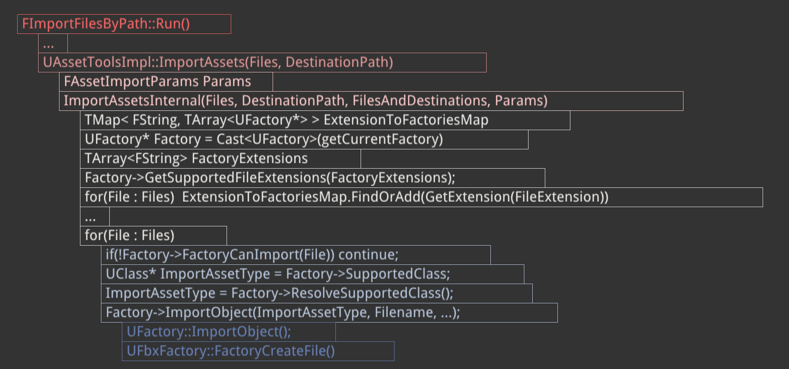

<!--truncate-->

https://easycomplex-tech.com/cnblog/Unreal/AssetEditor/UEAssetEditorDev-AssetTypeActions/

https://docs.unrealengine.com/4.27/zh-CN/ProgrammingAndScripting/ProgrammingWithCPP/Modules/

https://forums.unrealengine.com/t/generated-body-vs-generated-uclass-body/322489


https://www.youtube.com/watch?v=IaU2Hue-ApI

## 路径

` Source/Editor/UnrealEd/Classes/Factories`下有多个Factory类用于创建不同的资源，比如BluePrintFactory、CurveFactory、FbxFactory

基类Factory路径为`Source/Editor/UnrealEd/Classes/Factories/Factory.h`


## FbxFactory

断点打在UFbxFactory::FactoryCreateFile处进行debug，调用栈如下

```c++
FImportFilesByPath::Run()
    ...
    // Files is location in Disk，DestinationPath is ue filesystem, here is /Game/MyContent
    UAssetToolsImpl::ImportAssets(Files, DestinationPath)
        FAssetImportParams Params
        ImportAssetsInternal(Files, DestinationPath, FilesAndDestinations, Params)
            TMap< FString, TArray<UFactory*> > ExtensionToFactoriesMap
            UFactory* Factory = Cast<UFactory>(getCurrentFactory)
            TArray<FString> FactoryExtensions
            // Important : GetSupportedFileExtensions ==> actually use Formats
            Factory->GetSupportedFileExtensions(FactoryExtensions);
            for(File : Files)  ExtensionToFactoriesMap.FindOrAdd(GetExtension(FileExtension))
            ...
            for(File : Files)
                // Important : FactoryCanImport
                if(!Factory->FactoryCanImport(File)) continue;
                // Important : SupportedClass
                UClass* ImportAssetType = Factory->SupportedClass;
                // Important : ResolveSupportedClass
                ImportAssetType = Factory->ResolveSupportedClass();
                Factory->ImportObject(ImportAssetType, Filename, ...);
                    UFactory::ImportObject();
                    // Important: FactoryCreateFile
                    UFbxFactory::FactoryCreateFile()
```




