## 角色动画
### 蓝图结构
TODO: lyra其实把Weapon给单独拿出来了，WeaponInstance中有个PickBestAnimLayer函数，来进行AnimLayer的绑定，这里是简化的描述
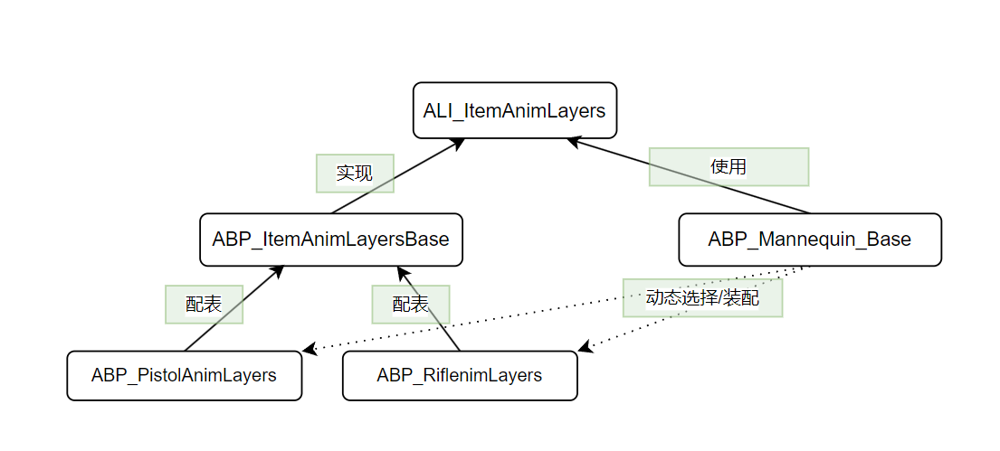

首先，ALI_ItemAnimLayers是一个抽象接口，在这里定义一些子AnimGraph
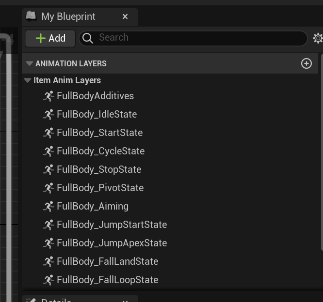
这些AnimGraph由ABP_ItemAnimLayersBase来实现，比如FullBodyIdleState的实现
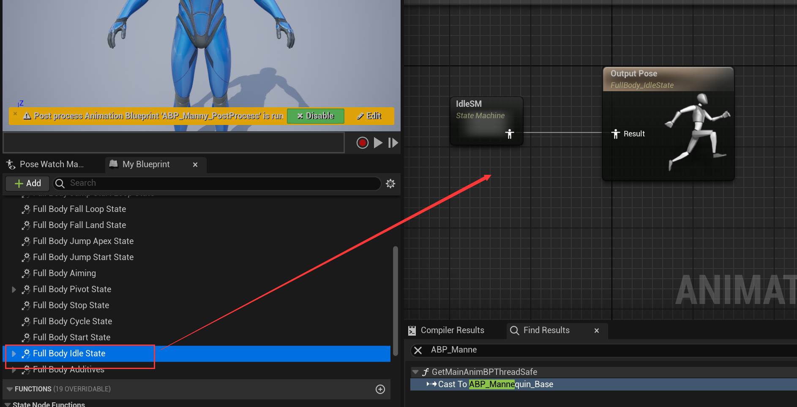

ABP_Mannequin_Base是主蓝图，会包含ALI_ItemAnimLayers接口中的所有子AnimGraph, 需要通过这里来设置
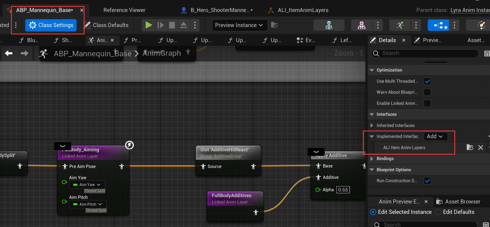
并会使用到这些AnimGraph的output pose，但只会作为插槽一样的存在，比如
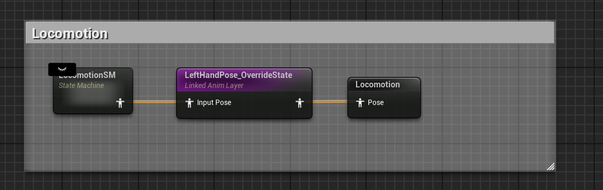
而子蓝图具体实现在ABP_ItemAnimLayersBase，暴露了一些可配置的参数，比如Idle采用的具体动画序列，在不同状态下是不同的（手枪/步枪/unarmed），这个会在运行时根据逻辑去选择（装配）

猜测一个大概的cpp实现是这样
```cpp
struct ALI_ItemAnimLayers{
    std::function<Pose()>  FullBodyIdleState;
    std::function<Pose()>  FullBodyCycleState;
    ...
}

struct ABP_ItemAnimLayersBase : public ALI_ItemAnimLayers{

    ABP_ItemAnimLayersBase(Config config){
        FullBodyIdleState = [](){
            ...
            Sequence seq = Load(config.sequencePath)
            return Pose(seq);
        }

        FullBodyCycleState = [](){
            ...
            Sequence seq = Load(config.sequencePath)
            return Pose(seq);
        }
    }
    
}

struct ABP_Mannequin_Base{
    ALI_ItemAnimLayers AnimLayers;

    void SelectAnimLayer(Context context){
        if(contex.use_pitsol){
            Config config("Path/to/pitsol_config");
            AnimLayers = ALI_ItemAnimLayers(config);
        }else if(contex.use_rifle){
            Config config("Path/to/rifle_config");
            AnimLayers = ALI_ItemAnimLayers(config);
        }
    }

    Pose AnimGraph(){
        SelectAnimLayer(GetOwner.context);
        auto Pose1 = ...;
        auto Pose2 = ALI_ItemAnimLayers[FullBodyIdleState]();
        return Blend(Pose1, Pose2, 0.5);
    }
}
```


### 动画蓝图多线程更新
BlueprintThreadSafeUpdateAnimation
武器挂载
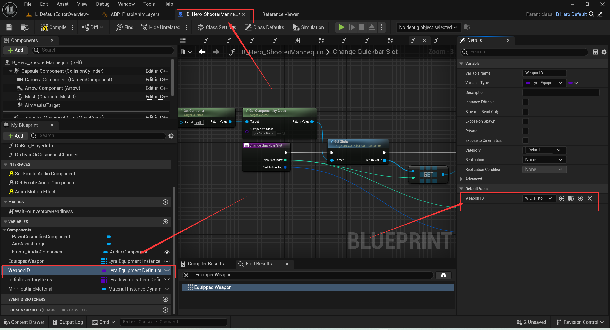
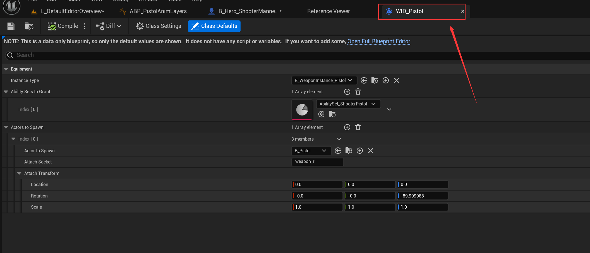
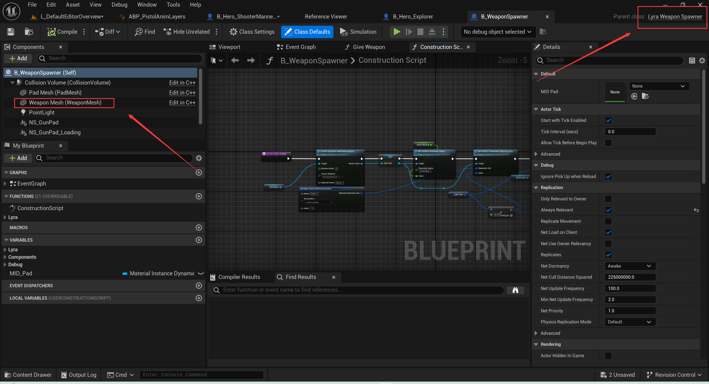
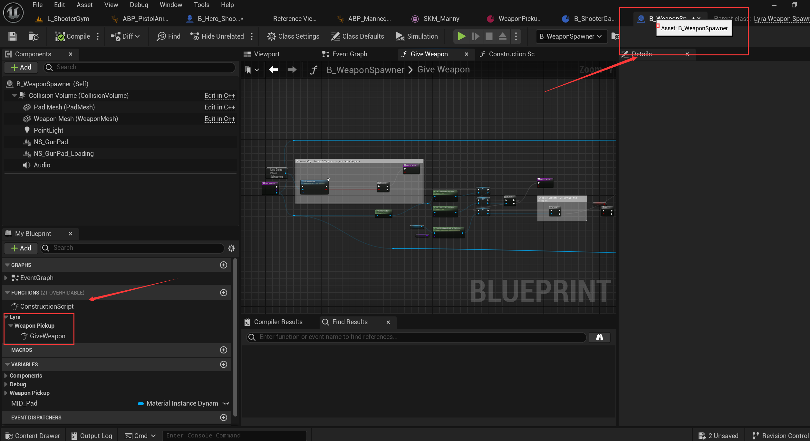

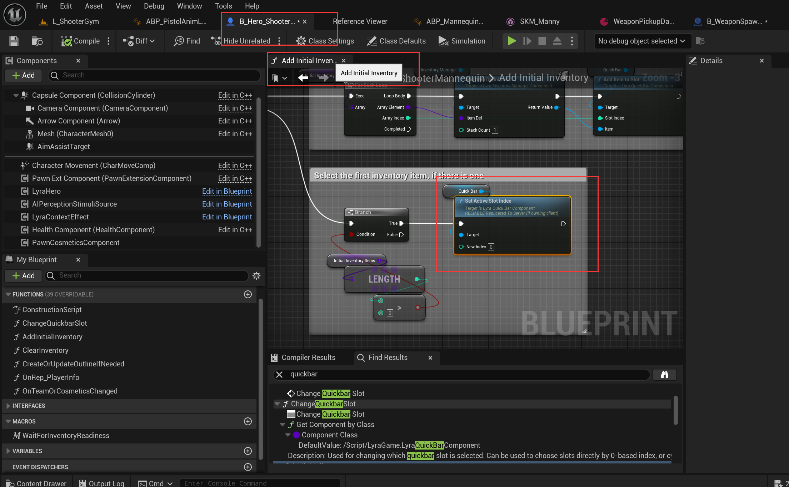
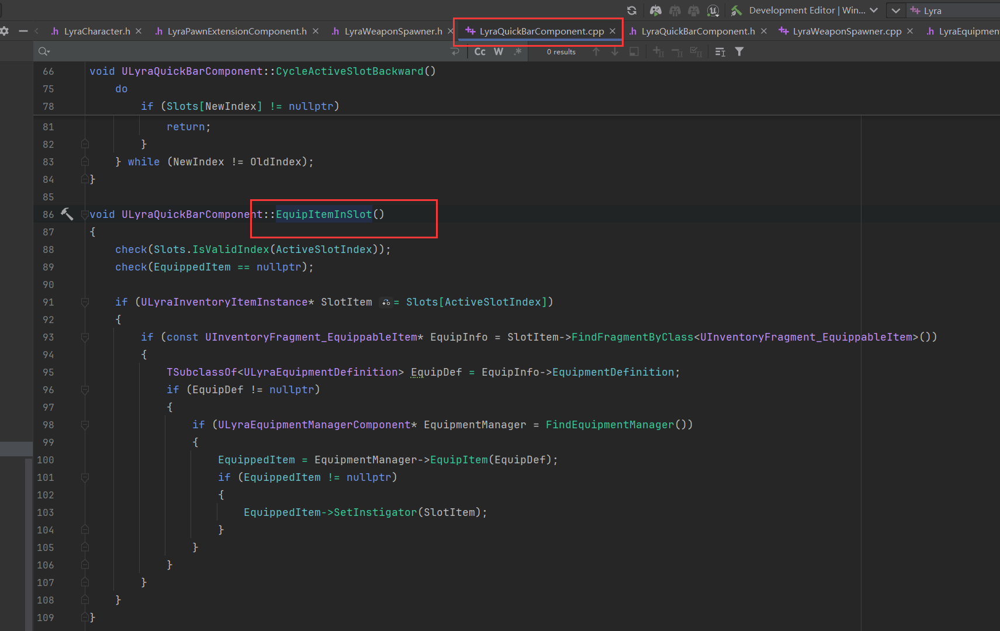

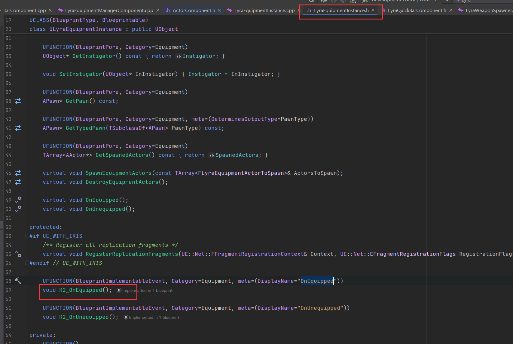
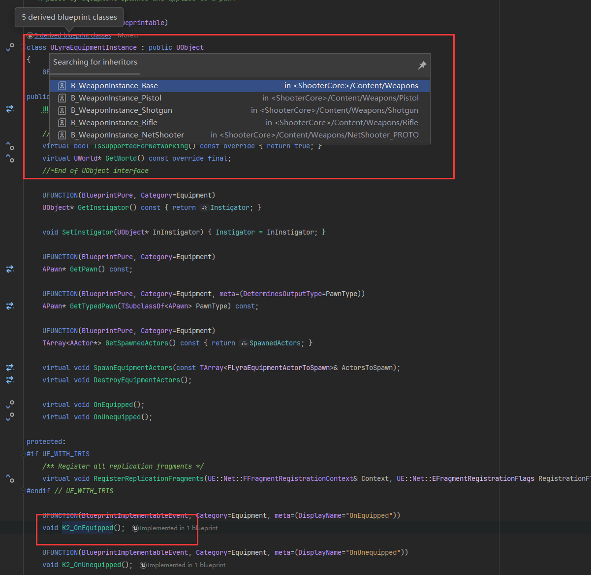
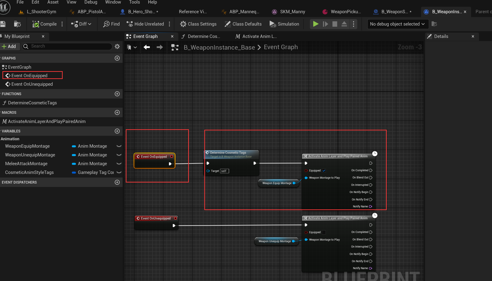