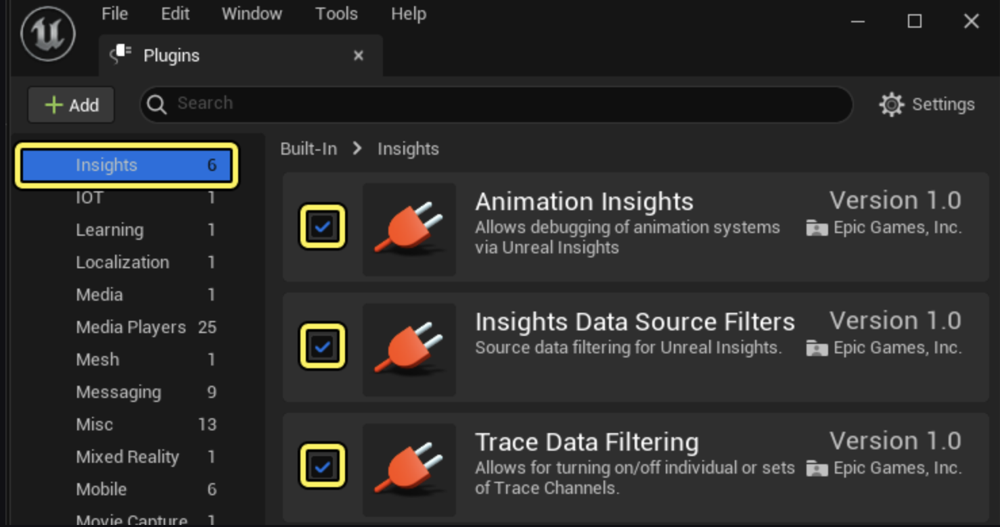
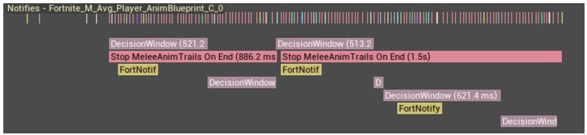
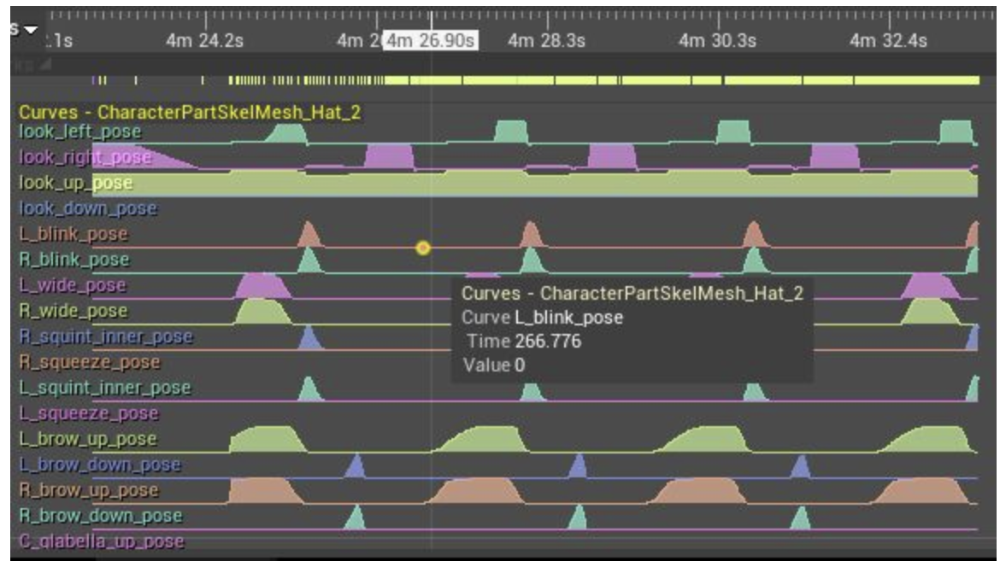
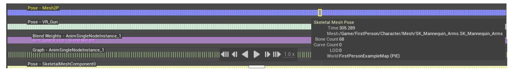
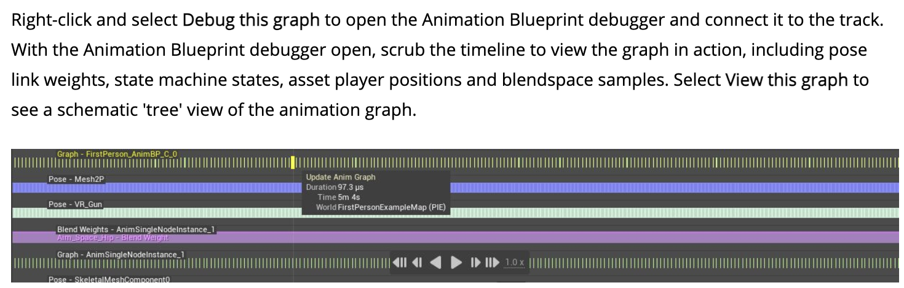
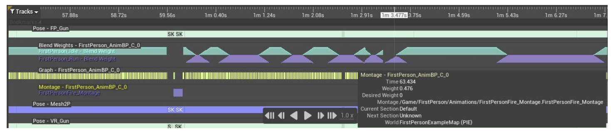
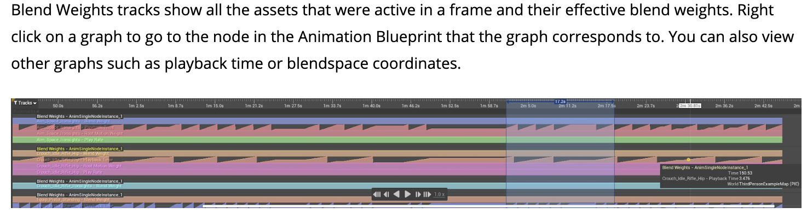
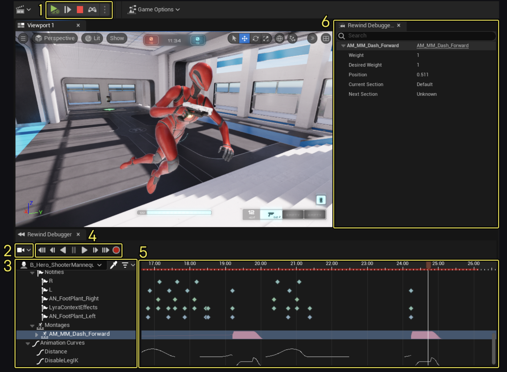

<!--truncate-->
## Introduction
UE4里面官方提供的animation debug的工具
* [命令行工具](https://docs.unrealengine.com/4.27/en-US/AnimatingObjects/SkeletalMeshAnimation/AnimationProductivityTipsAndTricks/)`ShowDebug ANIMATION`.开启后，会在PIE时屏幕上显示文字数据，主要是每个AnimNode的权重

* [Animation Insights](https://docs.unrealengine.com/4.27/en-US/TestingAndOptimization/PerformanceAndProfiling/UnrealInsights/AnimationInsights/), 可以额外trace动画相关的数据集成在Unreal Insight中


Animation Insights需要开启这三个插件，他记录的数据包括
1. Notifies


2. Curves


3. Pose


4. Graph


5. Montage


6. Blend Weights


[UE5 Rewind Debugger](https://dev.epicgames.com/documentation/en-us/unreal-engine/animation-rewind-debugger-in-unreal-engine)基于Animation Insight提供了一套新的操作界面


## Rewind Debugger界面


1. 控制simulation的开始、暂停与结束
2. 设置rewind使用的相机（静置、跟随某个actor、使用simulation的camera）
3. Object Outline
4. Playback Controls
5. Timeline
6. Rewind Debugger Details Pannel

## UE Rewind Debugger源码分析
代码位置
> /Engine/Plugins/Animation/GameplayInsights/Source/RewindDebugger
> 
> /Engine/Source/Editor/RewindDebuggerInterface

```cpp
// RewindDebuggerModule.h
// 入口
class FRewindDebuggerModule : public IModuleInterface{
    TSharedPtr<SRewindDebugger> RewindDebuggerWidget;
    TSharedPtr<SRewindDebuggerDetails> RewindDebuggerDetailsWidget;
}

// SRewindDebugger.h
// 总的界面UI

// SRewindDebuggerComponentTree.h
// 左侧Object Outline的UI

// SRewindDebuggerTimelines.h
// Timelines的UI

// IRewindDebuggerTrackCreator.h
class IRewindDebuggerTrackCreator : public IModularFeature{
    TShared<FRewindDebuggerTrack> CreateTrack(uint64 ObjectId) const {
        return CreateTrackInternal(ObjectId);
    }

    // 这个函数会被/Plugins/Animation/GameplayInsights/source/GameplayInsights中的一系列函数重写
    virtual TShared<FRewindDebuggerTrack> CreateTrackInternal(uint64 ObjectId) const;
}

// RewindDebugger.h
// 处理handles，比如拖动timeline、开始/结束recording、获取要记录的Actor的components
class FRewindDebugger : public IRewindDebugger{

}


```
