<!--truncate-->
# UE动画常用操作

## 动画融合方式
### 传统动画融合

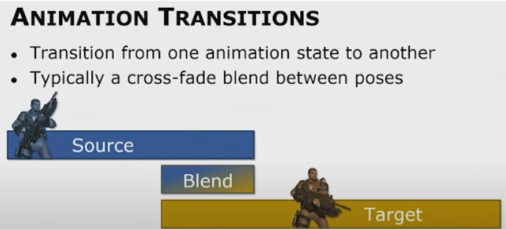

Blend那一段需要计算两端动画以及他们的混合，相当于双倍的动画开销

### 惯性融合Inertialization

*   现实里不会混合（挥手后放下，而不会边挥手边放下）
*   不进行blend，而是后处理解决不连续性

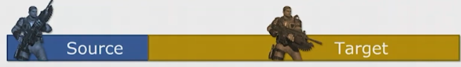

下面的曲线，是sequence1 - sequence2， 要做的工作是把他们的差值缓慢消除

插值成关于t的五次函数，参数由fade-off时间、两端序列首位的位置差和速度差 控制

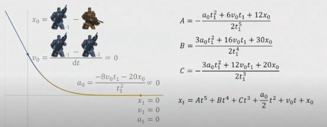


## Additive动画
用来对Base Pose叠加一些额外的效果，比如运动状态受击的轻微反馈、瞄准状态开枪后的后坐力效果。
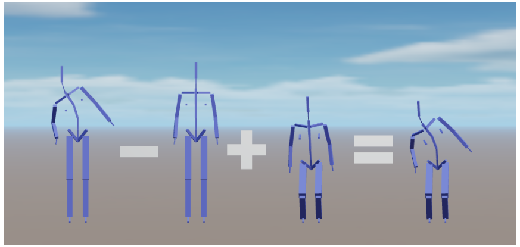
设Base Pose的Transform矩阵为B（所有joint），Reference Pose为R，Additive Pose（这里指被减数那个Pose）为A，那么Final Pose $F = (R^{-1}A)B$

下图1为BasePose，Addtive Pose为向上瞄准，图2采用Local Space Additive，把Addtive Pose基于父骨骼的Transform叠加到Base Pose的父骨骼上，会导致瞄准歪掉，不再是预期的正上方。而图3采用Mesh Space Additive，把Addtive Pose基于root的Transform叠加到父骨骼上,这里会进行一次坐标系转换：Transform矩阵从Mesh Space => Local Space,因此开销比较大。
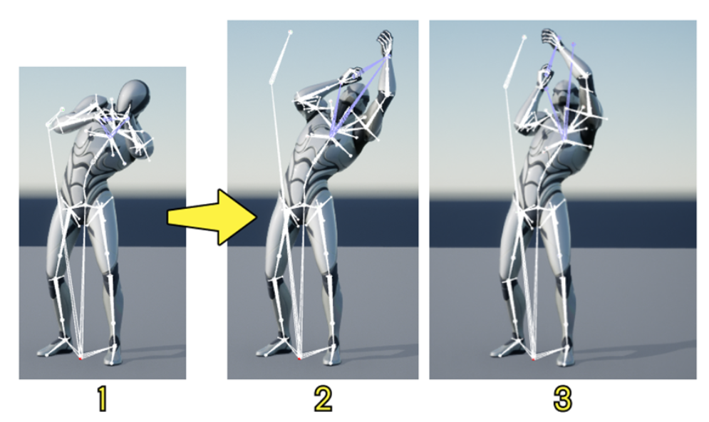

 $F = (R^{-1}A)B$在UE中的实现如下
```cpp
// FAnimationRuntime::AccumulateLocalSpaceAdditivePoseInternal
// 这里的RTS都是BasePose的成员变量
Rotation = VectorQuaternionMultiply2(BlendedRotation, Rotation);
Translation = VectorMultiplyAdd(Atom.Translation, BlendWeight, Translation);
Scale3D = VectorMultiply(Scale3D, VectorMultiplyAdd(Atom.Scale3D, BlendWeight, DefaultScale));
```
Mesh Space的话会有额外两步
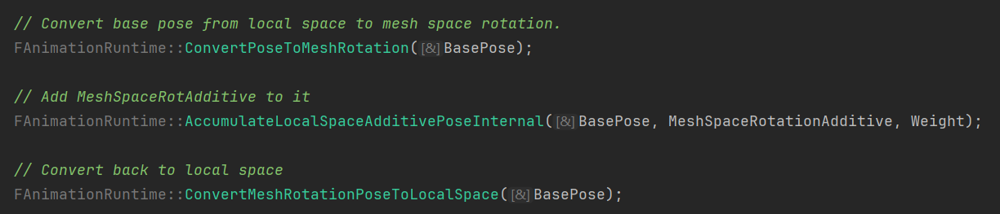
这里可以看出Mesh Space就是Root的Space,对于一条骨骼链，local space的rotation分别为R0,R1,R2, 那么Orientation2 = R0 * R1 * R2(想象机械臂从末端向root依次旋转)
```cpp
for (FCompactPoseBoneIndex BoneIndex(1); BoneIndex < LocalPose.GetNumBones(); ++BoneIndex)
{
    const FCompactPoseBoneIndex ParentIndex = LocalPose.GetParentBoneIndex(BoneIndex);

    const FQuat MeshSpaceRotation = LocalPose[ParentIndex].GetRotation() * LocalPose[BoneIndex].GetRotation();
    LocalPose[BoneIndex].SetRotation(MeshSpaceRotation);
}
```
这里注意,ue的FMatrix是[row-matrix需要右乘](https://mobile.rodolphe-vaillant.fr/entry/145/unreal-engine-c-tmap-doc-sheet-1)，但TQuat是左乘。

## Animation Montage
用来把多个AnimSequence合在一起根据game逻辑按任意顺序进行播放，一些基本的概念：
* Section: 把时间轴分为多个section，每个section可以放一段Sequence，可以根据逻辑切换播放每一段section，也可以设置section之间的混入
* Slot/Slot Group: Slot可以覆盖一个mesh或一个子mesh（比如FullBody/UpperBody），Slot在蒙太奇内设置，可以包含一些AnimSequence，设置好slot后就可以在ABP中使用，如下图，Slot节点在触发播放前会使用Source，比如Locomotion，而在触发后（比如角色按特定键）会override source动画。
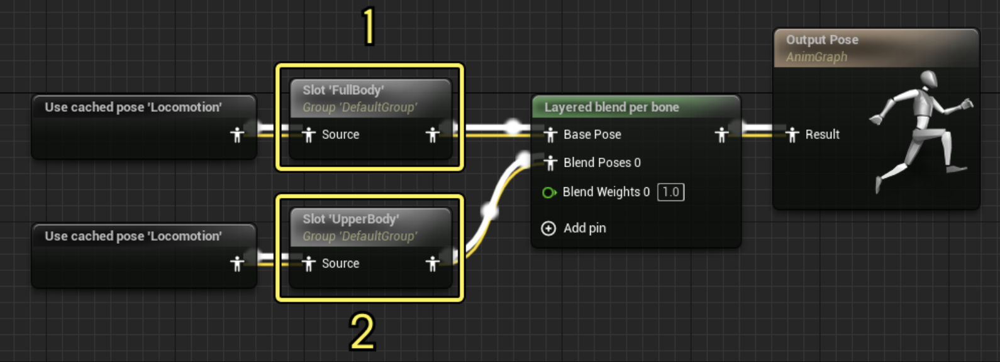
上图中，FullBody slot可以进行表情，而UpperBody可以放手部动画比如换弹。


## 重定向
Sequence A的Skeleton是S1， 把Sequence A应用到Skeleton S2上，要解决两点：

1.  建立骨骼对应关系：骨骼名称不同 / 骨骼数量不同 / 骨骼长度不同
2.  S1的初始Pose和S2的初始Pose可能不同（比如一个A-Pose 另一个T-Pose），因此某一帧动画，调整到同一Pose所需要的transform是不同的。


# 源码剖析
## 资产类
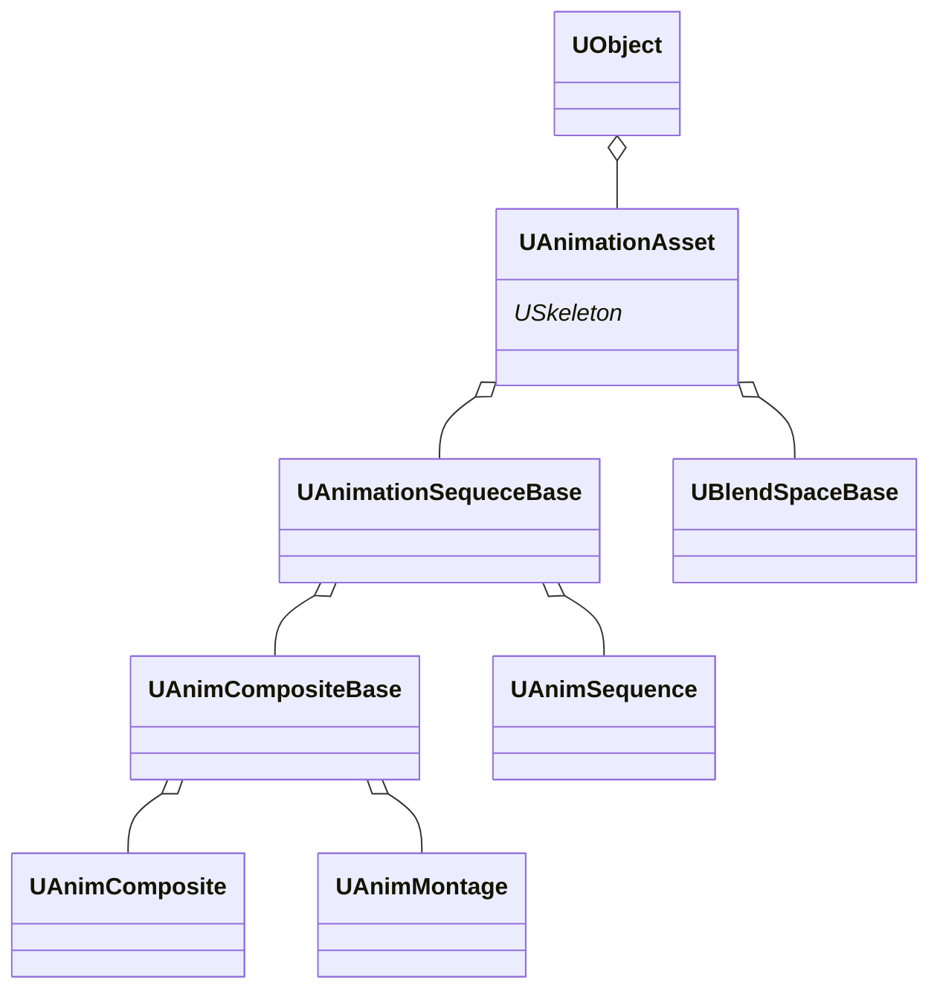

### 导入过程
FBX导入后一般会出现这几个资产

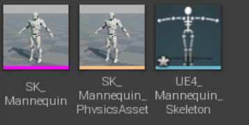

接下来的解析通过UFbxFactory::FactoryCreateFile来断点调试
```cpp
USkeletalMesh* BaseSkeletalMesh = nullptr;
BaseSkeletalMesh = FbxImporter->ImportSkeletalMesh( ImportSkeletalMeshArgs );
```

```cpp
USkeletalMesh* UnFbx::FFbxImporter::ImportSkeletalMesh(FImportSkeletalMeshArgs &ImportSkeletalMeshArgs)
{
    // 导入的fbx中的所有数据
    FSkeletalMeshImportData* SkelMeshImportDataPtr = nullptr;
    FillSkeletalMeshImportData(SkelMeshImportDataPtr, ...);

    // 最终要输出的skeletalmesh
    USkeletalMesh* SkeletalMesh = nullptr;

    
    // 写入USkeletalMesh的RefSkeleton成员
	SkeletalMeshImportUtils::ProcessImportMeshSkeleton( SkeletalMesh->GetRefSkeleton(),*SkelMeshImportDataPtr, ...);

    // 写入LOD蒙皮数据
    FSkeletalMeshBuildParameters SkeletalMeshBuildParameters(SkeletalMesh, GetTargetPlatformManagerRef().GetRunningTargetPlatform(), ImportLODModelIndex, bRegenDepLODs);
    bBuildSuccess = MeshBuilderModule.BuildSkeletalMesh(SkeletalMeshBuildParameters);
    
}
```

写入USkeletalMesh的RefSkeleton
```cpp
TArray <SkeletalMeshImportData::FBone>&	RefBonesBinary = ImportData.RefBonesBinary;
RefSkeleton.Empty();

// 用FReferenceSkeletonModifier对RefSkeleton作出修改
FReferenceSkeletonModifier RefSkelModifier(RefSkeleton, SkeletonAsset);
for (int32 b = 0; b < RefBonesBinary.Num(); b++){
    const SkeletalMeshImportData::FBone & BinaryBone = RefBonesBinary[b];
    const FString BoneName = FSkeletalMeshImportData::FixupBoneName(BinaryBone.Name);
    // 骨骼结构，静态存储的树以及对应的transform
    const FMeshBoneInfo BoneInfo(FName(*BoneName, FNAME_Add), BinaryBone.Name, BinaryBone.ParentIndex);
    const FTransform BoneTransform(BinaryBone.BonePos.Transform);

    RefSkelModifier.Add(BoneInfo, BoneTransform);
}


```


写入LOD蒙皮数据
```cpp
// Engine/Source/Developer/MeshBuilder/Private/SkeletalMeshBuilder.cpp

// 把LOD Mesh数据存入 USkeletalMesh.ImportedModel;
FSkeletalMeshLODModel& BuildLODModel = SkeletalMesh->GetImportedModel()->LODModels[LODIndex];
MeshUtilities.BuildSkeletalMesh(
			BuildLODModel, 
			SkeletalMesh->GetPathName(),
			RefSkeleton,
			LODInfluences,
			LODWedges,
			LODFaces,
			LODPoints,
			LODPointToRawMap,
			Options
		);
```


### USkeleton

USkeleton是UAnimationAsset的成员

```cpp
class USkeleton{
private:

UPROPERTY(VisibleAnywhere, Category=Skeleton)
TArray<struct FBoneNode> BoneTree;

FReferenceSkeleton ReferenceSkeleton;

public:
TArray<USkeletalMeshSocket*> Sockets;
TMap< FName, FReferencePose > AnimRetargetSources;

// FSmartNameContainer由两个map组成
// NameMapings: {FName : {[{CurveFName0, MetaData0}, {CurveFName1, MetaData1}, ... , {CurveFNameN, MetaDataN}]}}
// LoadedMappings：{FName : {[{CurveFName0, MetaData0}, {CurveFName1, MetaData1}, ... , {CurveFNameN, MetaDataN}]}}
FSmartNameContainer SmartNames;
}


// 用来在SkeletalMesh中挂载其他mesh，比如武器。
// 没有这个的话就只能在Actor的SkeletalMeshComponent下attach武器
class USkeletalMeshSocket{
    FName SocketName;
    FName BoneName;
    FVector RelativeLocation;
    FRotator RelativeRotation;
    FVector RelativeScale;
}

```

#### BoneTree

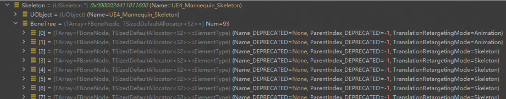

似乎不会使用，都是空的，具体得看一下导入fbx的流程有没有使用到这个

#### FReferenceSkeleton

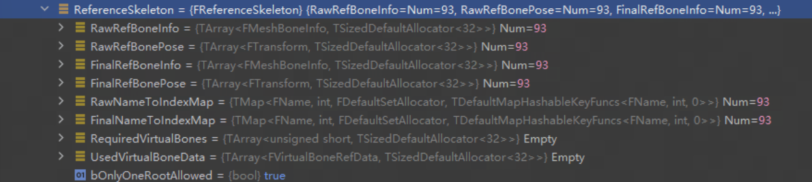

存储
* 原始的骨骼数据
* 加入了用户自定义virtual bone的全部骨骼数据

所有的骨骼用TArray静态存储树的结构，同时维护一个Name到Index的Map
```cpp
struct FMeshBoneInfo{
    FName Name;
    int32 ParentIndex; // root的parentindex是NoneIndex(-1)
}
struct FReferenceSkeleton{
// raw data
TArray<FMeshBoneInfo>	RawRefBoneInfo;
TArray<FTransform>		RawRefBonePose;

// raw data + virtual bone data
TArray<FMeshBoneInfo>	FinalRefBoneInfo;
TArray<FTransform>		FinalRefBonePose;

/** TMap to look up bone index from bone name. */
TMap<FName, int32>		RawNameToIndexMap;
TMap<FName, int32>		FinalNameToIndexMap;
}
```

#### FSmartNameCnntainer

可以自定义的属性，本身含有曲线属性

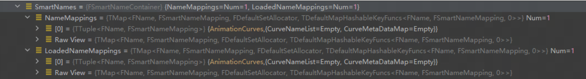

### SkeletalMesh

```cpp
class SkeletalMesh {
// editor-only
TSharedPtr<FSkeletalMeshModel> ImportedModel;

// runtime
// 下面分析了FSkeletalMeshModel， TODO 分析SkeletalMeshRenderData
TUniquePtr<FSkeletalMeshRenderData> SkeletalMeshRenderData;

USkeleton* Skeleton;
FBoxSphereBounds ImportedBounds;
TArray<FSkeletalMaterial> Materials;
UPhysicsAsset* PhysicsAsset;
}
```

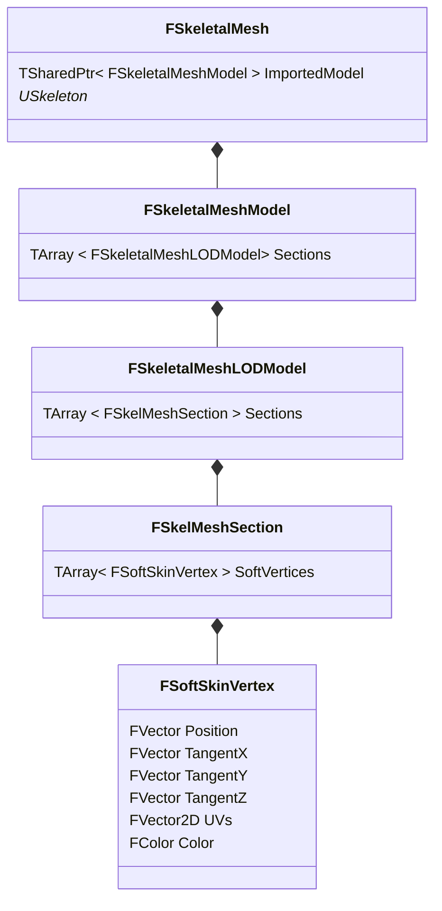

Skeletal Mesh渲染的模式<https://dev.epicgames.com/documentation/en-us/unreal-engine/skeletal-mesh-rendering-paths-in-unreal-engine>

在某一个LOD层，同一Material的Mesh称为一个Section，如果一个Section依赖太多骨骼，会通过一些几何算法进一步拆分成多个Chunk。

Chunk只会在运行时生成，和Section共用同一个数据结构

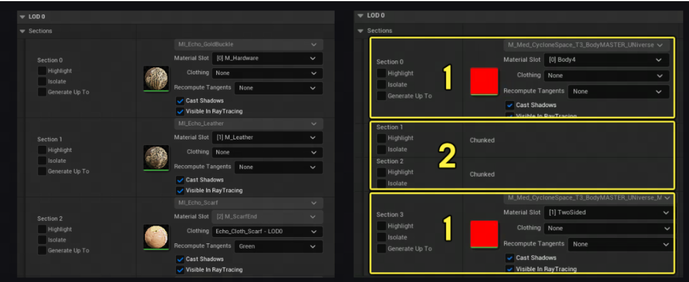

```cpp
class FSkeletalMeshModel{
// TIndirectArray 和TArray差不多，但堆里面存储的是指向元素的指针，可以避免resize的时候memcopy
TIndirectArray<FSkeletalMeshLODModel> LODModels;
}


// FSkeletamMeshLODModel 对应某层LOD的skeletal mesh数据
class FSkeletalMeshLODModel{
	TArray<FSkelMeshSection> Sections;
}

// SkelMeshSection
// 这是使用同一material的子mesh
// 也可能是Bone Chunking技术构造的子mesh，用于并行加速
struct FSkelMeshSection{
	int MaterialIndex;
	int BaseIndex; // 相对于Sections首地址的偏移值
	int BaseVertexIndex; // 顶点的offset
	int NumTriangles;
	
	// 所有顶点的具体信息，包括Position，TBN向量， UV坐标， FColor
	TArray<FSoftSkinVertex> SoftVertices;

	// 这一section用到的所有骨骼
	TArray<FBoneIndexType> BoneMap;

	/*
	 * If this section was produce because of BONE chunking, the parent section index will be valid.
	 * If the section is not the result of skin vertex chunking, this value will be INDEX_NONE.
	 * Use this value to know if the section was BONE chunked:
	 * if(ChunkedParentSectionIndex != INDEX_NONE) will be true if the section is BONE chunked
	 */
	int32 ChunkedParentSectionIndex;
}
```

### UAnimationSequence
UAnimSequenceBase中已经有了sequence所需要的核心数据和属性
```cpp
class UAnimSequenceBase : public UAnimationAsset {
    // 按时间先后排序
    TArray<struct FAnimNotifyEvent> Notifies;

    float SequenceLength;
    float RateScale;
    bool bLoop;

    // sequecen数据，包括骨骼动画数据和curve，
    // AnimSequence的instance会在运行时从DataModel中拿数据
    TObjectPtr<UAnimDataModel> DataModel;
}

class UAnimDataModel : public UObject, public IAnimationDataModel{
    TArray<FBoneAnimationTrack> BoneAnimationTracks;
    FFrameRate FrameRate; // 动画采样的帧率
    int32 NumberOfFrames; // 采样总帧数
    int32 NumberOfKeys; // 关键帧总数
    FAnimationCurveData CurveData;//曲线数据
}

// 一个track就对应一个bone的transform曲线
struct FBoneAnimationTrack{
    int32 BoneTreeIndex;
    FName Name;
    
    /*
    FRawAnimSequenceTrack：
    TArray<FVector3f> PosKeys;
    TArray<FQuat4f> RotKeys;
    TArray<FVector3f> ScaleKeys;
    */
    FRawAnimSequenceTrack InternalTrackData;
}

struct FAnimationCurveData{
    TArray<FFloatCurve>	FloatCurves; // FFloatCurve 就是TArray保存的time/value（float）
    TArray<FTransformCurve>	TransformCurves; // FTransformCurve 就是TArray保存的time/transform value（float3）
}
```

UAnimSequence定义了些额外的的属性，如动画压缩、插值方式等
```cpp
class UAnimSequence : public UAnimSequenceBase{
// 动画压缩配置文件
TObjectPtr<class UAnimBoneCompressionSettings> BoneCompressionSettings；
TObjectPtr<class UAnimCurveCompressionSettings> CurveCompressionSettings;

// 被压缩后的数据，压缩的方法无非就是
// 1. 线性插值造成的误差（这个误差一般是体现在mesh上的，比如绑两个点，计算替换前后这两个点的compnent space location）在一定threshold内的，只保留首位帧
// 2. 对数据进行压缩，比如float扩大多少倍后压缩成int8/int16
FCompressedAnimSequence CompressedData;

// Additive动画
TEnumAsByte<enum EAdditiveAnimationType> AdditiveAnimType; // local space / mesh space

// Retargeting
FName RetargetSource; //重定向的Base Pose

// 插值方式
EAnimInterpolationType Interpolation; // linear / step（用更近的那个key的值）

// RootMotion
bool bEnableRootMotion;
}
```


## 动画蓝图
### 动画蓝图执行流程
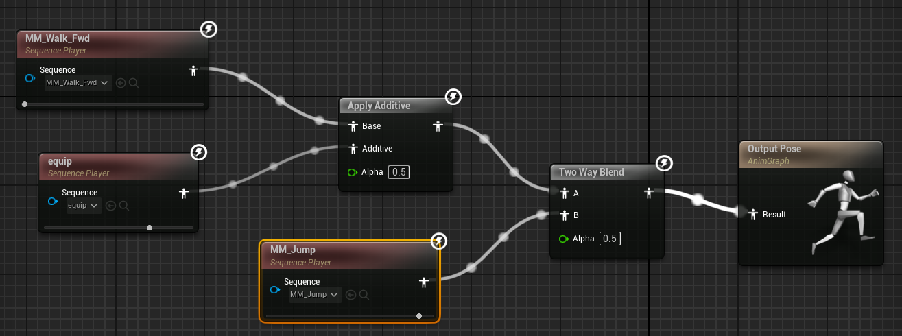
rewind中可以查看到三段sequence的blend比例分别为walk_fwd = 0.5，jump = 0.5，equip = 0.25
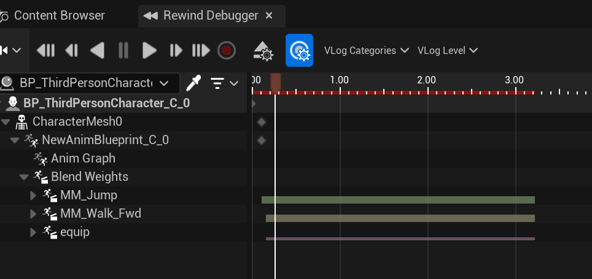
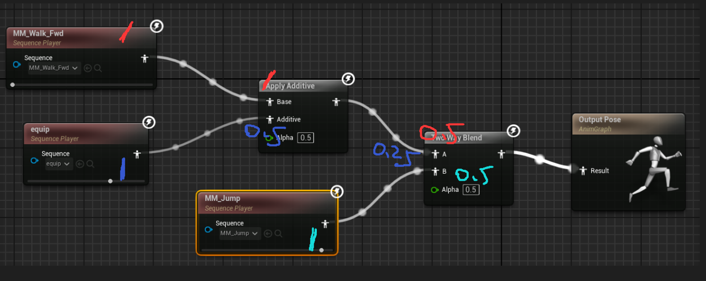

### Fast Path
下图中1、2均支持Fast Path， 官方文档写着：读成员变量、对结构体成员变量进行break操作以及Bool Not操作依然支持Fast Path，而其他数值运算不支持Fast Path（图三）。
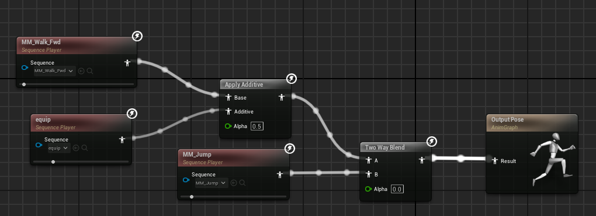
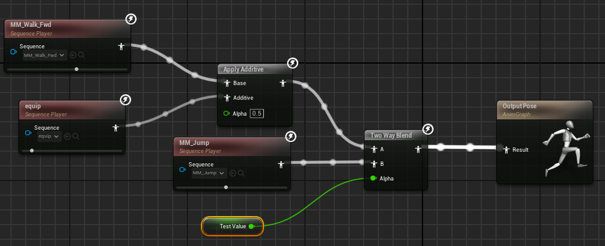
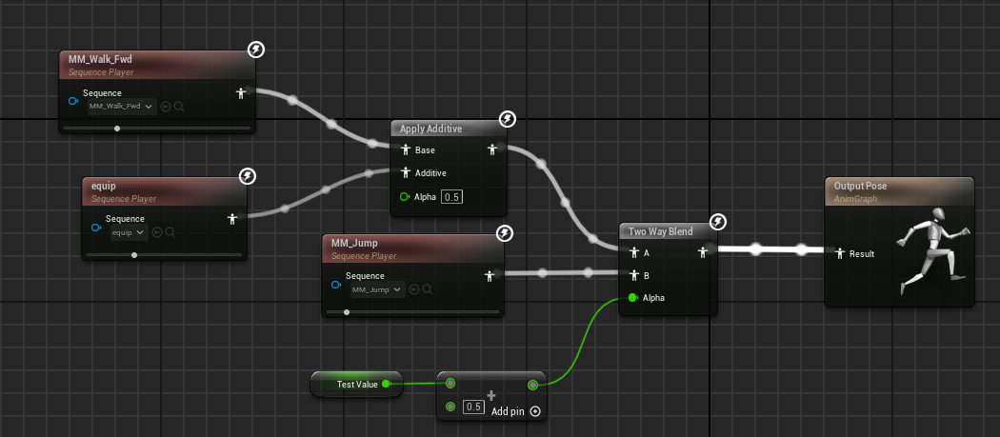

**什么是Fast Path**
使用FastPath，引擎就可以在内部复制参数，而不是执行蓝图代码，后者需要调用蓝图虚拟机在runtime对编译的蓝图字节码进行解释，测速验证结果如下。
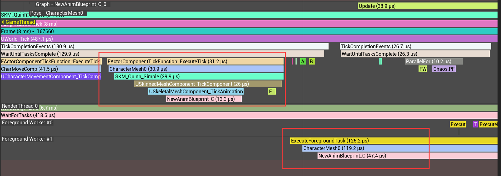
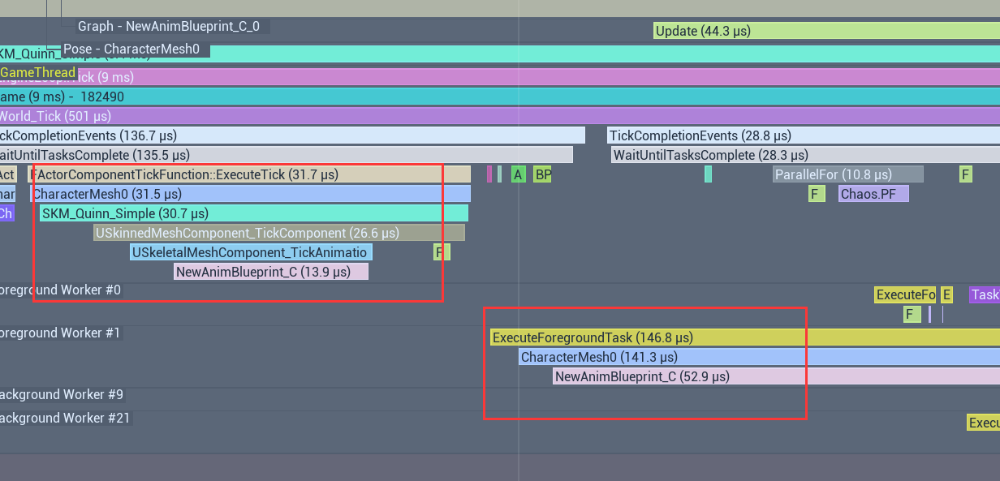
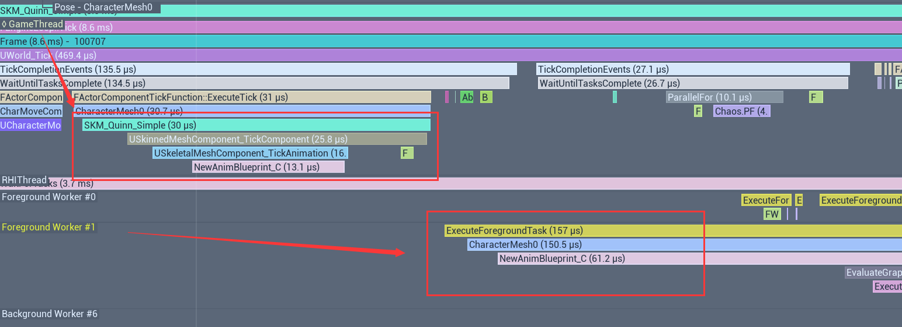
|graph|time|
|-|-|
|graph-1|13 + 47|
|graph-2|13 + 52|
|graph-3|13 + 61|


# Reference
* [addtive动画 cocos](https://docs.cocos.com/creator/3.8/manual/en/animation/marionette/additive-animation/)
* [addtive动画 博客](https://docs.unrealengine.com/4.27/en-US/AnimatingObjects/SkeletalMeshAnimation/AimOffset/)
* [addtive动画 UE4](https://docs.unrealengine.com/4.27/en-US/AnimatingObjects/SkeletalMeshAnimation/AimOffset/)
* [UE5官方文档 动画优化](https://dev.epicgames.com/documentation/zh-cn/unreal-engine/animation-optimization-in-unreal-engine)