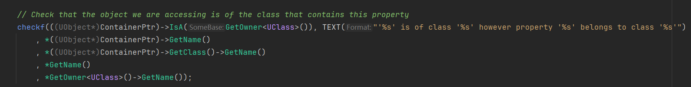

<!--truncate-->
## 问题引入
工作中遇到一个工具链任务，需要把一些蓝图的属性值，复制到对应名称的自定义DataAsset中，在获取蓝图资源后拿到了`UBlueprint* BP`,然后遍历Copy他的属性，
```cpp
for (TFieldIterator<FProperty> PropIt(BP->GenerateClass); PropIt; ++PropIt)
{
    FProperty* Property = *PropIt;
    FProperty* DataAssetProperty = FindFProperty<FProperty>(DataAssetClass, Property->GetFName());
    if (DataAssetProperty)
    {
        // Copy the value from the blueprint property to the DataAsset property
        void* BlueprintPropertyValue = Property->ContainerPtrToValuePtr<void>(BP);
        void* DataAssetPropertyValue = DataAssetProperty->ContainerPtrToValuePtr<void>(DataAssetInstance);
        Property->CopyCompleteValue(DataAssetPropertyValue, BlueprintPropertyValue);
    }
}
```
此时会崩溃，debug发现ContainerPtrToValuePtr中Assert Error，


最终定位到问题所在
`UBlueprint* BP`是个资产类，他可能继承了一个自定义的类比如`UWeapon`, 此时`BP->GenerateClass()`得到的是这个蓝图生成的cpp类，Name为"BlueprintName_C"，遍历这个类得到属性`FProperty* Property = TFieldIterator<FProperty> PropIt(BP->GenerateClass)`， 此时`Property->GetOwner<UClass>()`的Name为蓝图真正继承的类`UWeapon`，而`BP->GetClass()`就是"Blueprint".两者自然不是`IsA`关系。只有在蓝图BP被真正实例化的时候，才会转为蓝图继承的那个类`UWeapon`。

因此用下面的代码就可以实例化
```cpp
UClass* BlueprintClass = InBluerprint->GeneratedClass;
UObject* BlueprintInstance = NewObject<UObject>(GetTransientPackage(), BlueprintClass);
```
完整的测试代码如下

```cpp
void UTraceAnimInstance::TestTypeSystem(UBlueprint* InBluerprint)
{
	if(!InBluerprint) return;
	FString PropertyName, PropertyOuterName;
	UClass* BlueprintClass = InBluerprint->GeneratedClass;
	UObject* BlueprintInstance = NewObject<UObject>(GetTransientPackage(), BlueprintClass);
	if (!BlueprintInstance) return;

	FString BPName = BlueprintInstance->GetName();
	FString ClassName = BlueprintInstance->GetClass()->GetName();

	for (TFieldIterator<FProperty> PropIt(BlueprintClass); PropIt; ++PropIt)
	{
		FProperty* Property = *PropIt;
		if (Property)
		{
			PropertyName = Property->GetName();
			PropertyOuterName = Property->GetOwner<UClass>()->GetName();
			if(PropertyName == FString("First"))
			{
				void* BlueprintPropertyValue = Property->ContainerPtrToValuePtr<void>(BlueprintInstance, 0);
				break;
			} 
		}
	}
	FString LogStr = FString::Printf(TEXT("BPName: '%s', BPClassName: '%s', PropertyName: '%s', PropertyOuterName: '%s'"),
		*BPName,*ClassName, *PropertyName, *PropertyOuterName);
	UE_LOG(LogTemp, Log, TEXT("%s"), *LogStr);
	// GEngine->AddOnScreenDebugMessage(-1, 60.f, FColor::Yellow, Log);
}
```

我们还需要思考一些其他的问题：
* GetClass()
* GetOwner()
* IsA()
* GetName()
这些函数来自哪些类，他们的相互关系是什么，这就是UE的类型系统的内容。

## 类型系统结构
UE5的时候对UE4的系统结构进行了大改，分开来看
### UE4


