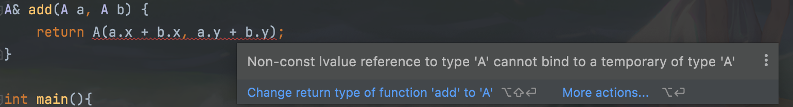

<!--truncate-->

## 头文件总体布局


guard（防卫式声明）

只有第一次include会include进来，第二次不会被include进来

```
#ifndef __Complex__
#define __Complex__
...


#endif
```

定义一个复数

```cpp
class complex{
  public:
  complex(double r = 0,double i = 0): re(r)	,im(i){}
   ...
  private:
  double re,im;
}

complex c1(0,0.5)
```

缺点：如果想把double改为float就得重新定义一个类

===> template(模版)

```cpp
template<typename T>
class complex{
  public:
  complex(T r = 0,T i = 0): re(r)	,im(i){}
   ...
  private:
  T re,im;
}

complex<double> c1(0,0.5)
complex<float> c1(0,0.5)
```


**Inline(内联)**

程序员设计是否inline只是给编译器建议，编译器最终是否inline取决于函数是否复杂。

```cpp
class complex{
  public:
  complex(double r = 0,double i = 0): re(r)	,im(i){}
  
  // 在class本体里直接定义的函数会自动inline
  double real() const	{return re;} // inline function
  double img() const;// declaration
  private:
  double re,im;
}

// class本体内声明了的，而本体外想要建议编译器inline需要加inline关键词
inline double img(const complex& x){
  return x.img();
}

void real(double r){real = r;}
```


**构造函数**

```cpp
class complex{
  public:
  // （1）最好写成这样，直接初始化 r和i
  complex(double r = 0,double i = 0): // =0为默认参数
  re(r)	,im(i) // 初始列
  {}   // 赋值
  // （2）而最好不要写成这样，先初始化， 再赋值r和i
  complex(double r = 0,double i = 0) {re = r; im = i};
  
  // 在class本体里直接定义的函数会自动inline
  double real() const	{return re;} // inline function
  double img() const;// declaration
  private:
  double re,im;
}

{
  complex c1(1,2);  //1+2i
  complex c1;  // 0 + 0i
  complex *p = new complex(4);
}
```

可以把构造函数放在private，表示该类对象不能被其他类创建，但是可以使用友元来创建。

应用：singleton(单例)设计模式

```cpp
class A{
public:
  static A& getInstance();
  setup(){...};
private:
  A();
  A(const A& rhs);
  ...
}

A& A::getInstance(){
  static A a;
  return a;
}

A::getInstance().setup();
```


**Overload(重载)**

同名函数，不同参数列表或返回值。

能重载的原因是，编译后不同参数返回值的同名函数在编译器看来名字并不一样


```cpp
class complex{
  public:
  // 1
  complex(double r = 0,double i = 0): re(r)	,im(i){}
  // 2
  complex():re(0),im(0){}
  // 1、2不能同时出现，因为1有默认值
  
  // 3
  double real() const	{return re;} // inline function
  double img() const;// declaration
  private:
  double re,im;
}

// 4
void real(double r){real = r;}
// 3、4可以同时出现
```


==const member function （常量成员函数）==

```cpp
double real() const{
	return re;
}
```


* const用在成员函数表示“不会改变类对象数据内容的成员函数”
* const int/double/complex 表示常量，不会发生变化的量

下面这种情况，const member function的const不可省略，否则编译不通过.

```cpp
double real() const{
	return re;
}

{
  const complex c(2,1);
  cout << c1.real();
}
```

==const 对象 只能调用 有const的成员变量==

* 类中某个函数加了const，这时候其他人定义的无论是const的对象还是非const的对象，都可以调用这个函数
* 但某个函数没有加const（即成员变量可以被修改），这时候其他人定义了一个const的对象，就无法再调用这个可以修改成员变量的函数了。

因此类设计者要应const尽const。


## 参数传递/返回值传递

* pass by Value
* pass by Reference
* pass by Reference Const

尽量不要pass by Value

引用在底层其实就是指针

Reference Const就是传递引用，但是函数不能对这个引用进行修改，否则编译会出错


* return  by Value

* return by Reference

  比较这两种方式

  （1）

  ```cpp
  inline complex& __doapl(complex *ths, const complex &r){// doapl == do assignment plus
    ths->re += r.re;
    ths->im += r.im;
    return *ths; // ths是个指针， *ths是指针指向的对象，返回一个对象的引用
  }
  
  // 此时，别人调用这个函数
  complex c3;
  c3 = __doapl(&c1, c2); // 等号前面的c1不用思索就能直接写了
  ```

  （2）

  ```cpp
  inline complex __doapl(complex *ths, const complex &r){// doapl == do assignment plus
    ths->re += r.re;
    ths->im += r.im;
    return *ths;
  }
  complex c3;
  c3 = __doapl(&c1, c2);
  
  
  inline complex __doapl(complex *ths, const complex &r){// doapl == do assignment plus
    ths->re += r.re;
    ths->im += r.im;
    return *ths;
  }
  complex *c3 = new complex();
  *c3 = __doapl(&c1, c2);
  
  // 调用者需要思考一下是写 c3 还是 *c3
  ```

  调用该函数的人不用知道传递的东西是什么形式的（by reference或by value）

* return by Reference Const

如果可以的话尽量返回reference，为了更快。

不能返回reference的情况：需要返回一个新创建的对象，而不能用已有的代替，因为在函数结束时，新创建的对象也没了！

## friend友元

声明一个friend函数，可以不经过public方法，直接获得类对象的private数据。

```cpp
class complex{
  public:
  complex(double r = 0,double i = 0): re(r)	,im(i){}·
  
  double real() const	{return re;} // inline function
  double img() const;// declaration
  private:
  double re,im;
  
  // 声明友元
  friend complex& __doapl(complex*, const complex&);
}

inline complex& __doapl(complex* ths,const complex& r){
  ths->re += r.re;
  ths->im += r.im;
  return *ths;
}


```


**相同class的各个Objects互为友元**

```cpp
class complex{
  public:
  complex(double r = 0,double i = 0): re(r)	,im(i){}
  
 int func(const complex& param){
   return param.re;
 }
  private:
  double re,im;
}

{
  complex c1(2,1);
  commplex c2;
  c2.func(c1);
}
```


## 操作符重载和临时对象

c++里操作符也是一种函数，可以重新定义的

### 类内部的操作符重载

```cpp
inline complex& __doapl(complex *ths, const complex &r){// doapl == do assignment plus
  ths->re += r.re;
  ths->im += r.im;
  return *ths;
}

// 1
inline complex& += (const complex &r){
  return __doapl(this, r);
}

// 2  是错的 this不能写出来 他是被编译器处理之后的结果（下图是示意图）
//    编译器处理后的this可能是第一个参数，也可能是最后一个参数，取决于不同的编译器
inline complex& += (this, const complex &r){
  return __doapl(this, r);
}


```

>  编译器看待“c2 += c1”
>
>  += (c2, c1)
>
>  +=是一个函数


**this**

所有的成员函数都含有一个隐藏的参数： this， 可以把它写出来。

谁调用这个函数，谁就是那个this。

this是个指针，指向调用函数的对象


> 为什么要设计成有返回值 而不是void： 为了 c1 += c2 += c3
>
> 从后往前： c2 += c3 然后 c1 += c2


### 类外的操作符重载

```cpp
c2 = c1 + c2
c2 = 7 + c1
//多种加法，所以不能在类里面重载
```


```cpp
inline complex operator + (const complex &x, const complex &y){
  return complex(x.real()+y.real(), x.img()+y.img());
}

inline complex operator + (int x, const complex &y){
  return complex(x + y.real(), x.img()+y.img());
}
```

==绝不能返回引用， 因为函数体内创建的临时对象会在函数结束后清空==




```cpp
cout << c1;
// 这里的<<只能写成非成员操作符重载，因为cout这个对象改不了
```

```cpp
#include <iostream>

ostream&
operator << (ostream &os, const complex &x){
  return os << real(x) << " " << img(x);
}

// 为了解决一连串的情况，所以不能设置成void返回值
cout << c1 << c2;
// 这个是从左往右的 cout << c1 再 << c2
```

上述返回值可以用&（不是临时对象）， 不能加const（为了连续输出）

### 临时对象

```cpp
complex(a, b) 
complex()
int(7)
```

这样的写法就是创建临时对象， 它的生命在下一行就结束了

需要在本行就进行其他操作，比如

```cpp
return complex()
std::cout << complex()
auto a = complex()
```

## ==设计一个class应该注意的事情==

1. 善用构造函数的initilization list
2. 成员函数加不加const， 应加尽加，否则会有副作用
3. 参数、返回值传递尽量pass by reference、return by reference，考虑能不能用reference（临时变量）
4. 数据尽可能放在private
