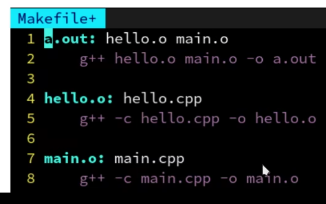
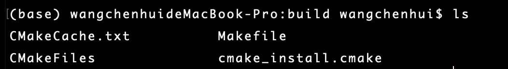
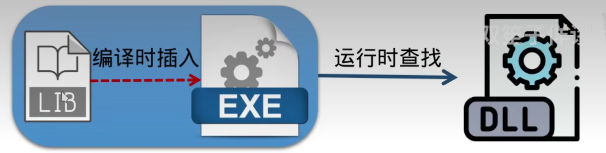
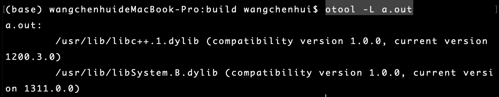
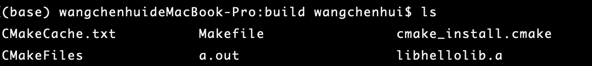
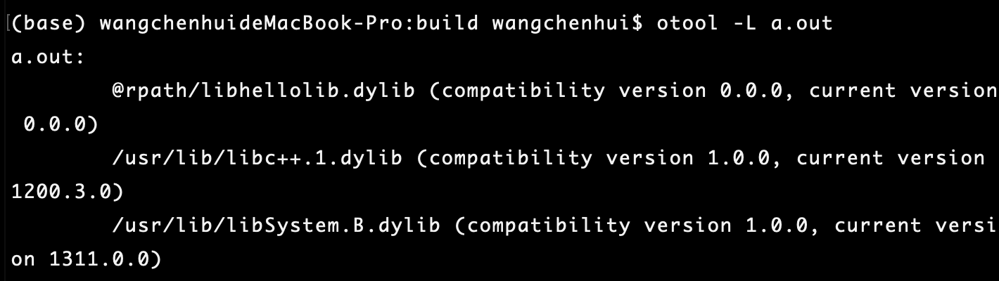
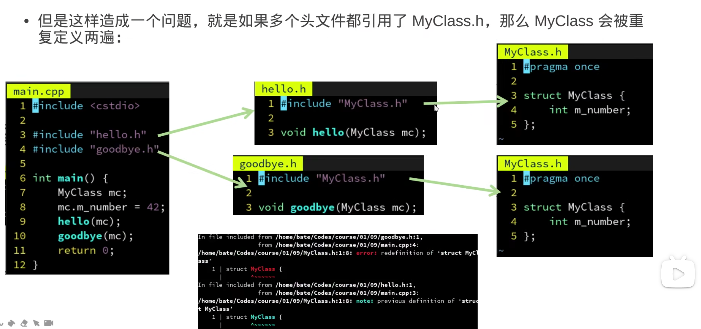
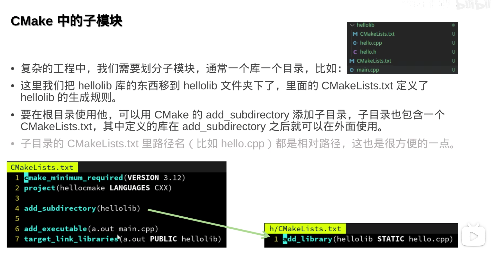

<!--truncate-->

## CH1

### 编译器

```bash
g++ main.cpp -o a.out

# less 可以让打印的反汇编上下滚动
objdump -D a.out | less


```

### 多文件编译和链接

#### 先把每个文件编译成临时对象文件


> g++ -c hello.cpp -o hello.o
> g++ -c main.cpp -o main.o
> g++ hello.o main.o -o a.out

```bash
# hello.cpp main.cpp

# solution1 & problem: After change one file, all files should be re compiled

g++ hello.cpp main.cpp -o a.out 

# solution2 "-c"生成临时的对象文件
g++ -c hello.cpp -o hello.o
g++ -c main.cpp -o main.o
g++ hello.o main.o -o a.out

```

#### Make到Cmake

GNU发明了make




| Make                       | Cmake                                            |
| -------------------------- | ------------------------------------------------ |
| Unix通用，Windows不通用    | CMakeList.txt ==>当前系统支持的                  |
| 准确指明每个项目之间的依赖 | 自动检测源文件和头文件之间的关系，导出到Makefile |
| 语法简单                   | CMake具有高级语法,可以make install               |
| 不同的编译器有不同的参数   | 自动检测编译器，添加flag                         |


CmakeLists.txt

```cmake
project(hellocmake)

add_executable(a.out main.cpp hello.cpp)                                          
```

>  cmake -B build

 构建文件到build目录



 执行

> make
>
> ./a.out

#### Library(库)

* 把共用的功能做成一个库，可以被可执行文件或其他库调用

* 分为 **静态库** 和**动态库**

  

  

 

#### Cmake中的静态库和动态库

查看动态链接内容

```bash
# Linux
ldd a.out

# MacOS
otool -L a.out
```




修改CMakeLists.txt

```cmake
project(hellocmake)

add_library(hellolib STATIC hello.cpp)
add_executable(a.out main.cpp hello.cpp)
target_link_libraries(a.out PUBLIC hellolib)
```

> STATIC 表示静态链接库

修改后build里增加了 libhellolib.a



然而查看链接内容并没有新增


修改CMakeLists.txt

```cmake
project(hellocmake)

add_library(hellolib SHARED hello.cpp)
add_executable(a.out main.cpp hello.cpp)
target_link_libraries(a.out PUBLIC hellolib)
```

> SHARED 表示动态链接库

*.dylib自动放在rpath路径下，make时链接




* 静态库（.a）被删除后仍可以运行
* 动态库（.so/.dylib）被删除后运行会报错 

#### 关于头文件

采用#include预定义，是一种直接的替换

* `<xxx.h>` 表示不要在当前目录下搜索
* `"xxx.h" `表示优先搜索当前目录，再搜索系统目录

**Problem： 多文件递归地引用同一个头文件**



**Solution**

* #pragma once
* #ifndef...


### Cmake子模块



同样的是一种预定义替换的方式

因为移动到了hellolib文件夹下，所以main.cpp要做一定修改

```
#include "hellolib/hello.h"
```

避免修改的方式为

CMakeLists.txt中添加

```
target_include_directories(a.out PUBLIC hellolib)
```


==Cmake更多内容新开一p来写。==

