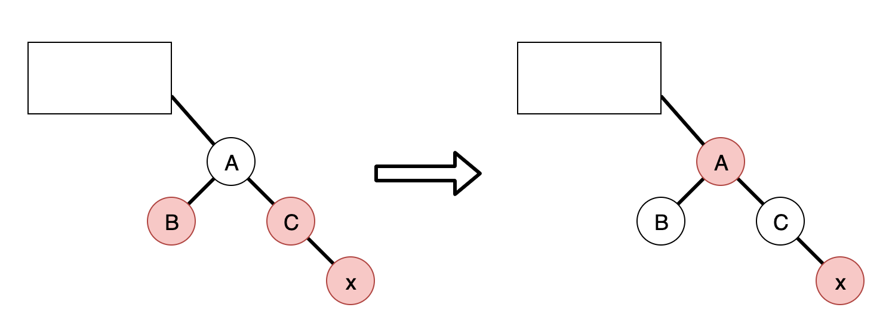
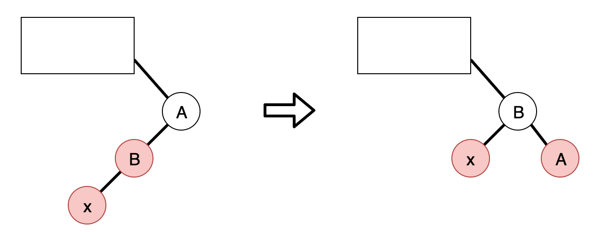
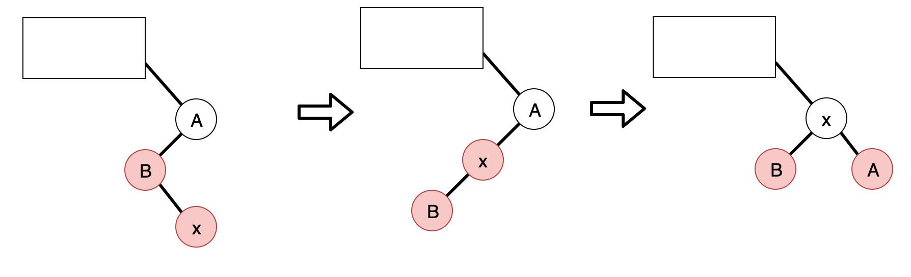
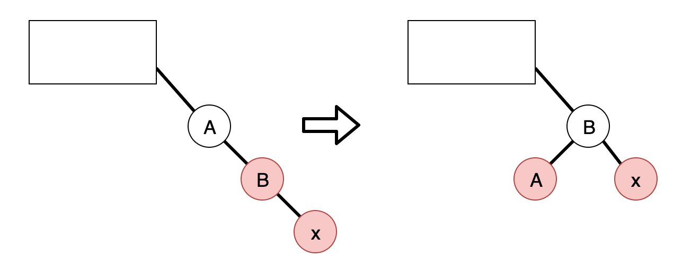
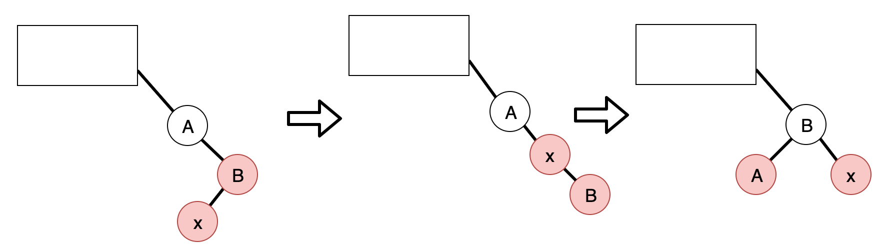

<!--truncate-->
## 定义和性质
红黑树是一种含有红黑结点并能自平衡的二叉查找树。它必须满足下面性质：
* 性质1：每个节点要么是黑色，要么是红色。
* 性质2：根节点是黑色。
* 性质3：每个叶子节点（NIL）是黑色。
* 性质4：每个红色结点的两个子结点一定都是黑色。
* 性质5：任意一结点到每个叶子结点的路径都包含数量相同的黑结点（黑色完美平衡）。定义为黑高black-height 记作bh(x)
为便于边界处理，我们采用一个和普通节点拥有相同数据结构的哨兵对象来代表叶节点NIL，叶节点不存储信息，只用来指示边界。

优秀的性质：一棵有n个内部节点的红黑树高度至多为2lg(n+1).因此增删查改操作复杂度都是O（lg n）

红黑树自平衡通过三种操作实现：
1. 左旋：以某个结点作为支点(旋转结点)，其右子结点变为旋转结点的父结点，右子结点的左子结点变为旋转结点的右子结点，左子结点保持不变。
2. 右旋：以某个结点作为支点(旋转结点)，其左子结点变为旋转结点的父结点，左子结点的右子结点变为旋转结点的左子结点，右子结点保持不变。
3. 变色：结点的颜色由红变黑或由黑变红。
上述旋转操作同AVL。

## 查找
因为红黑树是一颗二叉平衡树，并且查找不会破坏树的平衡，所以查找跟二叉平衡树的查找无异：
（1）从根结点开始查找，把根结点设置为当前结点；
（2）若当前结点为空，返回null；
（3）若当前结点不为空，用当前结点的key跟查找key作比较；
（4）若当前结点key等于查找key，那么该key就是查找目标，返回当前结点；
（5）若当前结点key大于查找key，把当前结点的左子结点设置为当前结点，重复步骤2；
（6）若当前结点key小于查找key，把当前结点的右子结点设置为当前结点，重复步骤2；

## 插入

插入操作包括两部分工作：一查找插入的位置；二插入后自平衡。
查找插入的父结点很简单，跟查找操作区别不大，需要注意的是插入的节点应该设置成红色，这是因为增加黑色节点必然会引起不平衡（性质5）

需要注意的是，下面所有示意图，圆圈+编号表示的节点（除了明确标出孩子节点的）表示以该编号为根节点的子树。

### 不会引起自平衡的情况
1. 红黑树为空
插入节点作为根节点，设置成黑色；

2. 插入节点key已存在
这里按照java hashmap的写法，默认key不重复，因此insert退化为update

3. 插入节点的父节点为黑节点
插入节点是红色，直接插入，无需自平衡

### 需要自平衡的情况
插入节点的父节点为红节点可能引起自平衡。首先，因为根节点一定是黑节点，所以插入节点的父节点一定不是跟节点，所以插入节点一定有祖父节点。

#### 叔叔节点存在并且为红节点

插入节点是红色，因为红节点的两个子节点必须是黑色，所以首先将插入节点的祖父和父辈的黑红红变为红黑黑，由于祖父节点变为红，对于上层可能会不满足性质4，因此将祖父节点作为新的插入节点（研究对象）。
考虑自下而上的变动到达边界条件，即如果祖父节点A是根节点了，必须重新将根节点刷为黑色，这样会使整体黑高增加1，这也是唯一一种会增加黑色节点层数的情景。

#### 叔叔节点不存在或为黑节点
以下类似于AVL分左左、左右、右左、右右四种情况
##### 1. 左左

##### 2. 左右

##### 3. 右左

##### 4. 右右

## 代码

