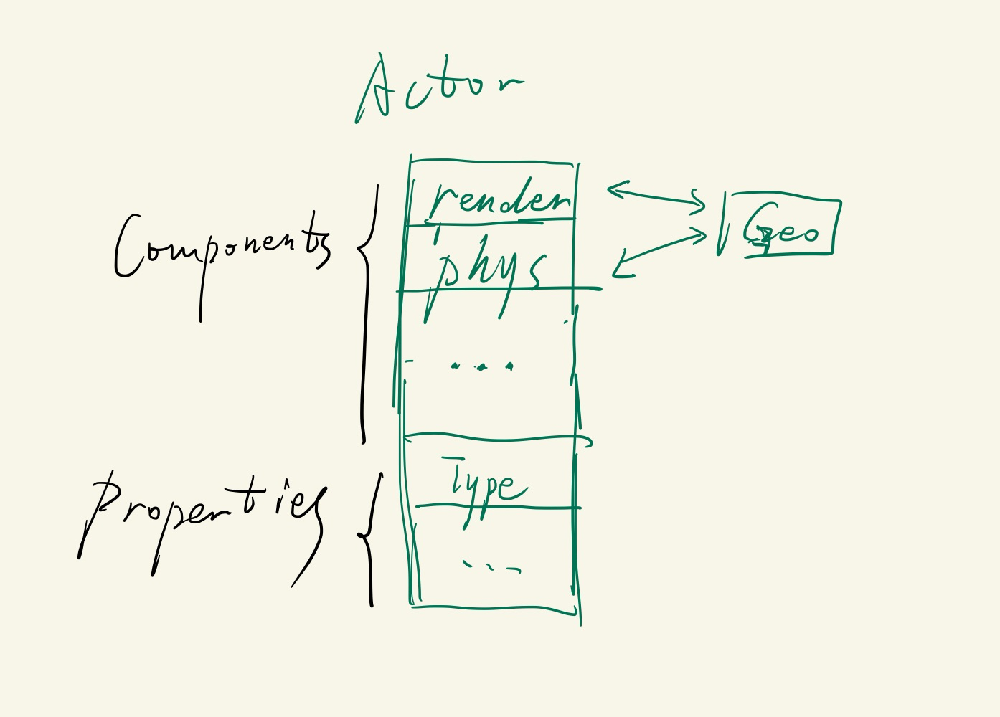
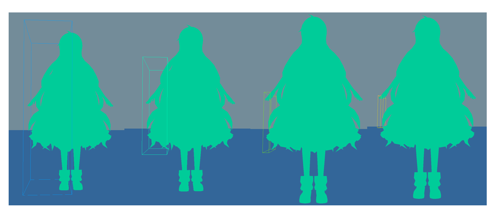
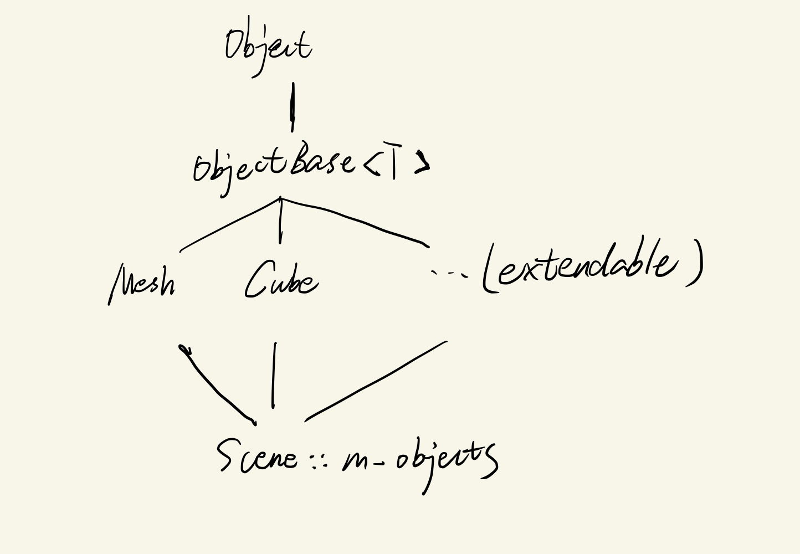
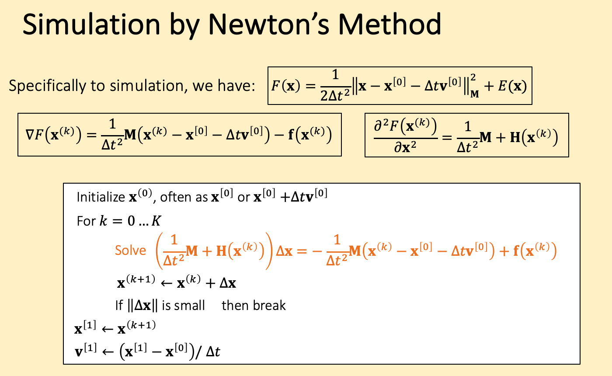
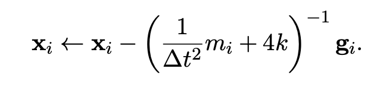

<!--truncate-->
## Before Reading
本项目只作为课程作业。[项目地址](https://github.com/CanoeByGuitar/GamePhysicsEngine)

## 总体模块
几何模块为公共的几何体，如line、circle、AABB、triangle、mesh等，并有相应的几何变换和空间加速方法。

物理和渲染模块都继承几何模块的类，物理模块可能有额外的质量、速度、形变梯度等数据，渲染模块有额外的三角形剖分、shader、VAO等数据

使用观察者模式和std::function实现，物理模块对Geometry产生更新时通知渲染模块进行动态渲染。



## 几何模块

### BVH

从距离的中点去划分，存在死循环的问题，当一个节点的兄弟节点为空时，就需要递归返回了，否则一个AABB中有n个三角形，划分后变为0 + n, 继续还是0 + n

```cpp
std::pair<BVHNode*, BVHNode*> SplitBVHNode(BVHNode* node){
        // x-alias partition
        auto bound = node->bound;
        std::vector<Triangle*> leftTriangles, rightTriangles;
        leftTriangles.reserve(node->triangles.size());
        rightTriangles.reserve(node->triangles.size());
        for(const auto& tri : node->triangles){
            if(GetMax(GetBound(*tri)).x < bound.position.x){
                leftTriangles.push_back(tri);
            }else{
                rightTriangles.push_back(tri);
            }
        }
        auto left = new BVHNode(GetBound(leftTriangles), std::move(leftTriangles));
        auto right = new BVHNode(GetBound(rightTriangles), std::move(rightTriangles));
        return {left, right};
    }

    void RecursiveBuildBVH(BVHNode* node, int kThreshold) {
        // Boundary Condition
        if(node->triangles.size() < kThreshold){
            return;
        }
//        if(BVH_DEPTH > MAX_DEPTH) return;

        PHY_DEBUG("Node bound pos: {}, halfSize: {}, triNum:{}", node->bound.position, node->bound.halfSize, node->triangles.size());


        // Split
        auto [leftNode, rightNode] = SplitBVHNode(node);

        if(!leftNode->triangles.empty() || !rightNode->triangles.empty()){
            std::vector<Triangle*>().swap(node->triangles);
        }

        bool shouldReturn = false;
        if(!leftNode->triangles.empty()){
            node->left = leftNode;
        }else{
            shouldReturn = true;
        }

        if(!rightNode->triangles.empty()){
            node->right = rightNode;
        }else{
            shouldReturn = true;
        }
        if(shouldReturn) return;

        // Recursive
        BVH_DEPTH++;
        RecursiveBuildBVH(node->left, kThreshold);
        BVH_DEPTH--;

        BVH_DEPTH++;
        RecursiveBuildBVH(node->right, kThreshold);
        BVH_DEPTH--;
    }
```

只从x方向取中点去划分也会导致AABB越来越细长



## 渲染模块



### CMakeLists.txt

```cmake
if(APPLE)
#   OPENGL
    find_package(OpenGL REQUIRED)

#   GLFW
    find_package(glfw3 REQUIRED)

    target_link_libraries(Renderer PUBLIC OpenGL::GL glfw)
```

这样就可以了，因为CMake会尝试查找名为`FindOpenGL.cmake`的模块文件。在本地mac中路径为

**~/brew-2.2.2/Cellar/cmake/3.23.2/share/cmake/Modules**

里面会设定一些库的名称，比如OpenGL::GL可以直接链接

```cmake
31 ``OpenGL::GL``
 32   Defined to the platform-specific OpenGL libraries if the system has OpenGL    .
 33 ``OpenGL::GLU``
 34   Defined if the system has OpenGL Utility Library (GLU).
 35 
 36 .. versionadded:: 3.10
 37   Additionally, the following GLVND-specific library targets are defined:
 38 
 39 ``OpenGL::OpenGL``
 40   Defined to libOpenGL if the system is GLVND-based.
 41 ``OpenGL::GLX``
 42   Defined if the system has OpenGL Extension to the X Window System (GLX).
 43 ``OpenGL::EGL``
 44   Defined if the system has EGL.
```


### VAO VBO EBO


### 思路

1 VAO <==> 1 VBO,  1 VEO  用一个GLVertexArray类

将一个GLVertexArray对象绑定一个物体，场景中可以加入多个物体，每个物体负责自己的GLVertexArray的GenBuffer、BufferData、Bind、UnBind


渲染的一个流程大概是：

* 设置渲染参数（比如深度测试、混合测试等）
* 设置MVP矩阵
* ==设置material（包括各种texture）【可以通过工厂模式，读取json】==（SetMaterial）
* 渲染第一帧
  * ==mesh ==> [vertices data, indices data]==(GetVerticesBuffer)
  * // 以下4个放在一个函数里（SetPipelineData）
  * ==生成 VAO, VBO, EBO==
  * ==vertices data ==> VBO==
  * ==indices data ==> EBO==
  * ==设置VAO的vertex attribute pointer， 并enable==
  * 
  * draw
* RenderLoop
  * Update mesh【物理运动】
  * 渲染一帧
    * ==mesh ==> [vertices data, indices data]==(GetVerticesBuffer)
    * ==更新texture, material（可能需要, 只需要更新material，而不用更新shader）==（SetMaterial）
    * // 以下4个放在一个函数里（SetPipelineData）
    * ==生成 VAO, VBO, EBO==
    * ==vertices data ==> VBO==
    * ==indices data ==> EBO==
    * ==设置VAO的vertex attribute pointer， 并enable==
    * 
    * draw

黄色部分写在ObjectBase里, ObjectBase被各种物体继承，比如Mesh, Cube等。

额外套一层Object是为了Scene里可以用```std::vector<std::shared_ptr<Object>> m_objects``` 来实现多态

```cpp
class Object{
    public:
        virtual ~Object() = default;
        virtual void SetPipelineData() = 0;
        virtual void GetVerticesBuffer() = 0;
        virtual void SetMaterial() = 0;
    };

template<typename VertexType>
class ObjectBase : public Object {
  public:
  virtual void SetPipelineData() = 0; // Setup VAO, VBO, VEO
  virtual void GetVerticesBuffer() = 0; // Get vertices and indices
  virtual void SetMaterial() = 0; // Set shader/material parameter/texture

  public:
  std::vector<VertexType> m_vertices;
  std::vector<unsigned int> m_indices;
  Shader *m_shader;
  GLVertexArray m_VAO{};
};
```


VertexType用来制定某个物体在渲染管线上，一个节点的格式，在ObjectBase的继承类中设置，方便拓展，比如

```cpp
struct MeshVertex{
        vec3 position;
        vec3 normal;
        vec2 coord;
    };

    class Mesh : public ObjectBase<MeshVertex>{
    public:
        ~Mesh() override;
        void SetPipelineData() override;
        void GetVerticesBuffer() override;
        void SetMaterial() override;

    private:
        std::shared_ptr<geo::Mesh> GeoMesh;
    };
```

虽然我们知道，一个模型，比如*.obj可能由很多个mesh组成，但我们将这种模型抽象为geo::mesh，在geometry中处理变换、缩放等操作，传输给renderer::mesh送上渲染管线。

## Physic模块

### cloth

#### implicit solver

注意 下图中的x[0] , v[0]表示第0时刻， x(0)表示newton的初始值



准确的Solve dx应该采用线性系统的解算器，比如jacobi、pcg等，这里用近似， g是一介导， hessian近似位一个对角阵，k是弹簧的K



两种初始化区别不大，在设定最大迭代次数位32时，前者为40ms/substep，后者为50ms/substep

**优化过程**

1. 最开始40ms
2. 

## C++

### std::string_view

c++17

```cpp
std::string s = "123456"; // 会把 c string 常量深拷贝给s 
std::string_view s = "123456"; //只包括首位两个指针， 不会拷贝，但read-only
```


## 坑

### 关于Model

以.obj为例，正常的obj file中，vertex是不会重复的，所以**vertices.size() < indices.size()**

但在load之后，主流的loader（比如assimp的默认参数和tinyobjloader）会把vertex重复来实现两个面的公共顶点具有不同的normal，所以**vertices.size() == indices.size()**

而我在渲染模块中采取了重复定点的方案，在物理模块使用了不重复的方案（后续优化），所以写了相互转化的函数。

* 不重复 ==> 重复， 这里转成 vector<Triangle*>

```cpp
auto& triVec = m_model->m_meshes[0].triangles;
    triVec.clear();
    triVec.reserve(m_indices.size() / 3);
    for(int i = 0; i < m_indices.size(); i += 3){
        auto tri = new geo::Triangle(
                m_vertices[m_indices[i]],
                m_vertices[m_indices[i + 1]],
                m_vertices[m_indices[i + 2]]
        );
        triVec.push_back(tri);
```

* 重复 ==> 不重复

```cpp
struct Vec3Hash {
    size_t operator()(const vec3& v) const {
        size_t seed = 0;
        std::hash<float> hasher;
        seed ^= hasher(v.x) + 0x9e3779b9 + (seed << 6) + (seed >> 2);
        seed ^= hasher(v.y) + 0x9e3779b9 + (seed << 6) + (seed >> 2);
        seed ^= hasher(v.z) + 0x9e3779b9 + (seed << 6) + (seed >> 2);
        return seed;
    }
};

std::unordered_map<vec3, int, Vec3Hash> vertexMap;
std::vector<vec3> uniqueVertices;
uniqueVertices.reserve(m_vertices.size());

// 注意要遍历face
for (int i = 0; i < m_indices.size(); i++) {
  auto vertIdx = m_indices[i];
  auto it = vertexMap.find(m_vertices[vertIdx]);
  if (it == vertexMap.end()) {
    int newIndex = static_cast<int>(uniqueVertices.size());
    vertexMap[m_vertices[vertIdx]] = newIndex;
    uniqueVertices.push_back(m_vertices[vertIdx]);
    m_indices[i] = newIndex;
  } else {
    m_indices[i] = vertexMap[m_vertices[vertIdx]];
  }
}
uniqueVertices.shrink_to_fit();
m_vertices = std::move(uniqueVertices);
PHY_INFO("after deduplicate: {} vertices, {} indices",
         m_vertices.size(), m_indices.size());
```


**拼接mesh**

```cpp
for (const auto &mesh: m_model->m_meshes) {
        m_indices.reserve(m_indices.size() + mesh.indices.size());
        auto tempSize = m_vertices.size();  // 易错
        for(int i = 0; i < mesh.indices.size(); i++){
            m_indices.push_back(mesh.indices[i] + tempSize);
        }
        m_vertices.reserve(m_vertices.size() + mesh.vertices.size());
        m_vertices.insert(m_vertices.end(), mesh.vertices.begin(), mesh.vertices.end());
    }
```


### switch case

原理是跳转到相应的case往下执行，所以必须加break

```cpp
switch(x):
case a:
	break;
case b:
	break;
```


### IMGUI 与 renderer层级

IMGUI面板在顶层，所以放在后面

```cpp
///////////// physics
m_physics->Update(dt);

///////////// renderer
m_camera.Update(dt);
m_renderer.Update(m_camera);
auto renderList = m_scene->GetObjects();
m_renderer.Render(m_camera, renderList.cbegin(), renderList.cend());


//////////// Gui
m_gui->Draw(m_window.m_window);
```

### 鼠标在IMGUI面板上时禁用摄像头转动

在gui类里include Input.h， Input类中声明bool m_mouseClickEnabled, 同时监听鼠标与面板的关系，对m_mouseClickEnabled进行修改，MouseClicked监听事件加入判断

```cpp
std::function<void(int, int, int)> mouseClicked = [&](auto button, auto action, auto mode){
  if(m_mouseClickEnabled && button >= 0 && button < 128){
    switch (action){
      case GLFW_PRESS:
        //                    PHY_INFO("press");
        m_buttons[button] = true;
        break;
      case GLFW_RELEASE:
        m_buttons[button] = false;
        //                    PHY_INFO("release");
        break;
    }
  }
};
```

gui类内

```cpp
 if (ImGui::IsWindowHovered())
        {
            // Disable mouse actions by capturing mouse input events
//            ImGui::CaptureMouseFromApp(true);
            Input::GetInstance().disableMouse();
            // Optionally, you can also disable keyboard input events
            // ImGui::CaptureKeyboardFromApp(true);
        }else{
            // Release mouse input events when the mouse is not hovering
//            ImGui::CaptureMouseFromApp(false);
            Input::GetInstance().enableMouse();
            // Optionally, release keyboard input events
            // ImGui::CaptureKeyboardFromApp(false);
        }
```


### 全局变量 static / extern

编译单元就是一个cpp，并且展开里面所有的#include

#### static 定义本编译单元的全局变量

```cpp
// Base.h
static int x;

// A.cpp (A 编译单元)
#include <Base.h>
x = 1; // A_x

// B.cpp (B编译单元)
#include <Base.h>
x = 2;  // B_x


// A_x和B_x存在两个不同的地址 是不一样的
```

#### extern 声明本编译单元或其他编译单元的全局变量

首先是**定义**和**声明**的区别

```cpp
int x; // 定义 未初始化
int y = 1; // 定义 并初始化
extern int x; // 声明
extern int x = 0; // 定义，能编译但一般不这么用
```


这里的全局，只能用于**相互链接**的某一个或几个库(STATIC, SHARED都可以)、或executable

相互链接是通过```target_link_libraries(lib_a PUBLIC lib_b)```

在打包某一个库时，必须保证他用到的全局变量在[这个库或他链接的库内部]**定义**

```cpp
add_library(render A.cpp B.cpp C.cpp)
  
add_library(physic D.cpp)  
target_link_libraries(physic render) 
  // physics只能用render，physics里定义的全局变量
  // 而render并不能用physics里定义的全局变量
  
  
add_executable(main main.cpp)
target_link_libraries(main render physic) 
  // main只能用render，physics里定义的全局变量
  // 而render,physics并不能用main里定义的全局变量
```


```cpp
// case 0
add_executable(main A.cpp B.cpp C.cpp)
  
// case 1
// D.cpp查找不到A.cpp中定义的全局变量
//  Undefined symbols
// 因为physic和render是两个独立的库，所以互相查不到 可以通过target_link_libraries(physic render)解决
add_library(render A.cpp B.cpp C.cpp)
add_library(physic D.cpp)  
add_executable(main main.cpp)
target_link_libraries(main render physic)
  
// case 2
// 可以的 因为main链接了render库
add_library(render A.cpp B.cpp C.cpp)
add_executable(main main.cpp)
target_link_libraries(main render)
```


在某一个模块里**定义**一个全局变量，在本模块或其他模块使用这个全局变量需要**声明**

* 必须在cpp中**定义**全局变量，否则可能会redefinition error

```cpp
// A.cpp
int x; // 注意这是定义，只是没有初始化
void f(){
  x = 5;
}

// B.cpp
extern int x; // 加了extern表示声明
x = 6;

// C.cpp
extern int x; // 加了extern表示声明
std::cout << x;
```

* 在header中声明，用于简化

```cpp
// A.cpp
int x; // 注意这是定义，只是没有初始化
void f(){
  x = 5;
}

// Base.h
extern int x;// 加了extern表示声明

// B.cpp
#include <Base.h> 
x = 6;

// C.cpp
#include <Base.h>
std::cout << x;
```


* 在header中定义的话

```cpp
////// 正确
// A.h
extern int x; // 声明 在本模块或其他模块存在x的定义

// A.cpp
#include "A.h"
int x = 5;
int main(){
    std::cout << x;
}


////// 错误 redifinition
// A.h
extern int x = 0; // 这是定义

// A.cpp
int x = 5;
int main(){
    std::cout << x;
}
```

#### 实践

在demo里定义全局变量，控制imgui事件对渲染、仿真结果做出改变

```cpp
// demo.cpp

// 定义只在demo.cpp会用到的变量
namespace control{
    static geo::BVHNode* currNode;
    static vec3 ground_color = {0.2, 0.4, 0.6};
    static vec3 ground_pos = vec3(0, -1.2, 0);
    static vec3 ground_halfSize = vec3(100, 1.2, 100);
    static int show_level = 10;
}

// 声明需要去外部找的变量
namespace control{
    extern vec4 clear_color;
    extern geo::BVHSplitStrategy bvh_strategy;
}
void f(){control::clear_color ....}

// RenderSystem.cpp
// 声明需要去外部找的变量
namespace control{
    extern vec4 clear_color;
}
void f(){control::clear_color ....}

// GuiSystem.cpp
// 定义全局变量
namespace control{
    vec4 clear_color = vec4(0.45f, 0.55f, 0.60f, 1.00f);
}


// 包含关系
add_library(Gui GuiSystem.cpp)
  
add_library(RenderSystem RenderSystem.cpp)
target_link_libraries(RenderSystem Gui)

add_executable(demo demo.cpp)
target_link_libraries(demo RenderSystem Gui)

```

### 虚函数

Derived类的第一个虚函数必须定义，只声明不定义会报错

```cpp
Undefined symbols for architecture x86_64:
  "vtable for Cloth", referenced from:
      ActorBase<geo::Model>::InitPhysicsObject() in BVHTest.cpp.o
  NOTE: a missing vtable usually means the first non-inline virtual member function has no definition.
```

**虚函数的默认参数不会被继承**，通过什么类型的指针调用，就会用对应的默认参数

### opengl

glDrawElement 如果画的是三角形primitive，并且ebo出现 （1，1，0）这样重复的顶点会报错

### Texture uv坐标

stb_image读取的图片和opengl渲染管线读入的 y坐标要返转一下

https://gamedev.stackexchange.com/questions/140789/texture-coordinates-seem-to-have-flipped-or-incorrect-position

```cpp
m_coord[i] = vec2(vertices[i].TextureCoordinate.X,
                  1- vertices[i].TextureCoordinate.Y);
```

