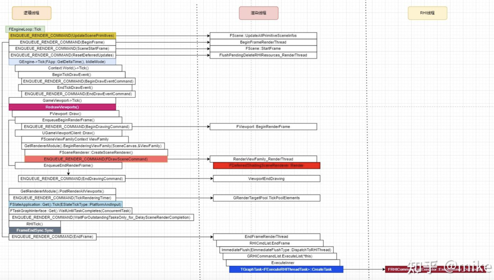
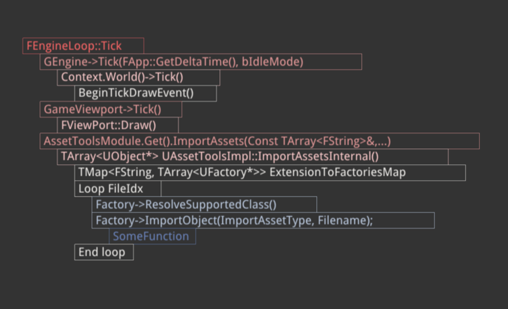

<!--truncate-->
## Idea

在写笔记的时候常常需要用ipad手绘或绘图软件（drawio）绘制简单的图表，例如类图。

想摆脱ui操作，通过代码直接生成这些，例如下面的代码。

* 无反射版本，重新编译生成

```cpp
// Call Stack Graph
void f1(){}

void f2(){
  f1();
}
void f3(){
  f2();
}
void f4(){
  f3();
}
int main(){
  f4();
}

// v0
HierarchyCallStack cs;
cs.Add("main");
cs.In();
cs.Add("f4()")
cs.In();
cs.Add("f3()")
cs.In();
cs.Add("f2()")
cs.In();
cs.Add("f1()")
cs.Out();
cs.Out();
cs.Out();
cs.Out();

// v1
// txt
// main in f4 in f3 in f2 in out out out out

```

* 反射版本（TODO）

预期最终要能绘制出这样的图



Mac Only is enough.

## Reference

box2d

ECS-Template


## Demo

​	

