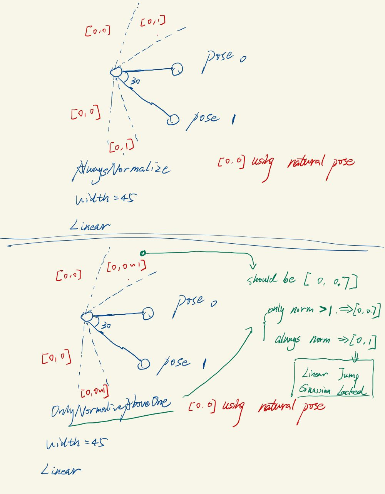

## 概要

**根据主骨骼当前旋转角和Targets旋转角，插值出Blendshape权重或次级骨骼Transform**


**使用RBF插值，把Rm（旋转维度） ==> Rn（Target数量）, 优点：平滑曲线、可以控制每个插值点的影响范围，既能做到局部影响也能做到全局影响**


**分解旋转为轴向（Twist）和非轴向（Orientation）**


## 调研技术方案

针对一个rig，在旋转某些骨骼时会导致蒙皮mesh出现不自然的状况（比如手肘转动带动肌肉、弯腰带动衣服）。此时对mesh的修正主要有两种思路：

1. blendshape：创建多个target，每个target有一个权重，动画师调整这些target的权重曲线（key帧 帧间B-Spline插值）。**缺点**：需要存储很多Mesh顶点信息，无论是内存还是计算时间开销都更大
2. 次级骨骼：为需要的主骨骼添加多个次级骨骼，制作动画时，key好主骨骼之后，再key次级骨骼的Transform。

这两种的共同点是：

1. 主骨骼旋转需要调整Mesh，需要动画师去编辑Mesh或编辑次级骨骼间接编辑Mesh。
2. 在key的动画的过程中实现编辑Mesh，对于新的动画无法复用。

引入PSD，根据主骨骼旋转位置，插值出blendshape权重或次级骨骼Transform。在maya中使用手柄拖动时也能看到调整Mesh的生效，制作动画时只需要key主骨骼关键帧即可。


**方案**： 在游戏流水线中引入基于骨骼的PSD流程，打通 Maya/MotionBuilder/Unreal/Max

**Reference**:
1.  J.P.Lewis.  Pose Space Deformation: A Unified Approach to Shape Interpolation and Skeleton-Driven Deformation, http://scribblethink.org/Work/PSD/PSD.pdf
2.   EigenSkin: Real Time Large Deformation Character Skinning in Hardware(https://zhuanlan.zhihu.com/p/205192636)
3.   Fast and Deep Facial Deformations: 
4.    Skin Deformation Methods for Interactive  Character Animation. 2017 
 Survey  for skinning deformation methods: 

Chad. https://www.chadvernon.com/tags/maya/
### UE PoseWrangle 
https://dev.epicgames.com/community/learning/tutorials/r04p/unreal-engine-authoring-secondary-animation-in-maya-and-unreal-with-pose-driver-connect

https://www.unrealengine.com/marketplace/en-US/product/pose-driver-connect?sessionInvalidated=true


* 如果当前是psd设置为twist，但是有pose是swing得到的，会直接报错
* 如果权重都为0， 就用natrual pose
## RBF Solver
是一种非线性插值，样本（以下称Samples）为$\{X, Y = f(x)\}$

其中$X = ( x_1,...,x_n), x_i \isin R^{d_1}, Y = (y1, ..., y_n), y_i \isin R^{d_2}$, n为样本个数

* 解算出$f(.)$

* 对于新输入的一个Query $q \isin R^{d_1}$, 计算出  $f(q) \isin R^{d_2}$

列举出几种实际应用中的取值
1. 手柄拖动中间的cube移动，移动到四周的每个cube上时，旋转角应当和该处cube相同，$x_i$是一个position(d1 = 3), $y_i$是对应于Samples每一个样本点的权重（d2=n）
2. 角色动画中，拖动一个手肘关节旋转，次级骨骼随之进行平移/旋转/缩放，$x_i$是一个手肘关节的欧拉角(d1 = 3), $y_i$是对应于Samples每一个样本点（称为pose）的权重（d2=n）


可以看出 
1. **在应用中一般 d2 == n**, 即最终求到的函数值为每一个样本点的权重， 比如$x = x_i时， f(x_i) = [0, 0, ..., 1, 0, ..., 0]$，第i位为1，其余为0
2. $f$ 是一个把 $R^{d_1}$ 映射为 $R^{d_2}$的函数， 因此可以把$f$看成一个矩阵

$$
A_{d2\times d1} x_{d1 \times 1} = y_{d2 \times 1}
\\
\begin{bmatrix}
w11 & w12 & ... & w1d_1 \\
w21 & w22 & ... & w2d_1 \\
... & ... & ... & ... \\
wd_{2}1 & wd_{2}22 & ... & wd_{2}d_1 \\
\end{bmatrix}
\cdot
\begin{bmatrix}
 x^1\\
 x^2\\
 ...\\
 x^{d1}   
\end{bmatrix}
=
\begin{bmatrix}
 y^1\\
 y^2\\
 ...\\
 y^{d2}   
\end{bmatrix}
$$

**求解矩阵A的方法：**
构建出待求解方程

$
D{ij}=Distance(i, j) = ||x_i - x_j||$  (或其他度量距离方式)

$$
\phi_{n\times n} A_{n \times d1} = Y_{n \times d1}

\\
\begin{bmatrix}
\phi(D_{11}) & \phi(D_{12}) & ... & \phi(D_{1n}) \\
\phi(D_{21}) & \phi(D_{22}) & ... & \phi(D_{2n}) \\
... & ... & ... & ... \\
\phi(D_{n1}) & \phi(D_{n2}) & ... & \phi(D_{nn})\\
\end{bmatrix}
\cdot
\begin{bmatrix}
w11 & w12 & ... & w1d_1 \\
w21 & w22 & ... & w2d_1 \\
... & ... & ... & ... \\
wd_{2}1 & wd_{2}22 & ... & wd_{2}d_1 \\
\end{bmatrix}
=
\begin{bmatrix}
 y^1_1 & y^1_2 &...  & y^1_{d1}\\
 y^2_1  & y^2_2 &...  & y^2_{d1}\\
 ... & ... &... &...\\
 y^{d2}_1   & y^{d2}_2 &...  & y^{d2}_{d1}
\end{bmatrix}
$$
最后的一个矩阵中，每一行是一个样本点（pose）的y， 形如[0, 0, ..., 1, 0, ..., 0], 解这个方程可以对A和Y矩阵拆分成列分别来求
$$
\phi_{n\times n} A1_{n \times 1} = Y1_{n \times 1} \\
\phi_{n\times n} A2_{n \times 1} = Y2_{n \times 1} \\
...\\
\phi_{n\times n} An_{n \times 1} = Yn_{n \times 1} \\
$$
对于每一个形如Ax=b， A为nxn, x为nx1, b为nx1的线性方程组, det(A)!=0时有唯一解，Micchelli定理保证了高斯核时，det(A)!=0，其他情况未保证【这里不确定，没有看过证明】，因此再解算的时候通过
$$
A^TAx=A^Tb
$$
这里$A^TA$一定是对称且正定的，再使用Cholesky分解进行解算。


## RBF SDK实现
1. 传入的x(样本) 和 KernalWidth（Sigma）是radiance欧拉角,
2. 计算距离的结果是radiance，计算距离有两种
   1. 欧拉角的欧氏距离
   2. 四元数的球面角
3. 计算phi(Distance(x)，kernalWidth), 传入的kernalWidth和distance都是radiance的
4. 解算
5. 查询Query 传入radiance欧拉角

总的来说，把RBF SDK作为一个黑箱，输入的都是Radiance，输出的是 0 ~ 1的权重序列

### 计算距离
```cpp
template <typename value_t>
struct EuclideanDistMetric : public DistMetricBase<value_t>{
    using vector_t = typename DistMetricBase<value_t>::vector_t;
    value_t eval(const vector_t& A, const vector_t& B) override{
        return (A - B).norm();
    }
};

/// return arc distance in radiance
template <typename value_t>
struct ArcLengthMetric : public DistMetricBase<value_t>{
    using vector_t = typename DistMetricBase<value_t>::vector_t;

    vector_t Euler2Quaternion(value_t roll, value_t pitch, value_t yaw){
        vector_t q(4);
        value_t cy = cos(yaw * 0.5);
        value_t sy = sin(yaw * 0.5);
        value_t cp = cos(pitch * 0.5);
        value_t sp = sin(pitch * 0.5);
        value_t cr = cos(roll * 0.5);
        value_t sr = sin(roll * 0.5);

        value_t w = cr * cp * cy + sr * sp * sy;
        value_t x = sr * cp * cy - cr * sp * sy;
        value_t y = cr * sp * cy + sr * cp * sy;
        value_t z = cr * cp * sy - sr * sp * cy;
        q << x, y, z, w;
        return q;
    }

    value_t eval(const vector_t& A, const vector_t& B) override{
        // Euler to Quaternion
        vector_t A_quat = Euler2Quaternion(A[0],
                                  A[1] ,
                                  A[2] );
        vector_t B_quat = Euler2Quaternion(B[0] ,
                                           B[1] ,
                                           B[2] );
        value_t dotValue = A_quat.dot(B_quat);
        auto ret = acos(2.0 * dotValue * dotValue - 1.0) ;
        return ret;
    }
};
```
### 计算phi
```cpp
/// Linear kernel: (sigma - d) / sigma  if 0 < d < sigma , equal 0 otherwise
template <typename value_t>
struct RBFLinear : public RBFKernelBase<value_t> {
    explicit RBFLinear( value_t sigma) : mSigma(sigma){}


    value_t eval(const value_t &dist) const override {
        auto clamp = [](value_t left, value_t right, value_t x){
            if(x < left) return left;
            else if(x > right) return right;
            else return x;
        };
        return (mSigma - clamp(0, mSigma, dist)) / mSigma;
    }

protected:
    value_t mSigma;
};

/// Exponential kernel: e^(-2 * d / sigma)
template <typename value_t>
struct RBFExponential : public RBFKernelBase<value_t> {
    explicit RBFExponential(value_t sigma) : mSigma(sigma){}


    value_t eval(const value_t &dist) const override {
        return std::exp( -2  * dist / mSigma);
    }

protected:
    value_t mSigma;
};

/// Cubic:  max(1 - d^3 / (sigma^3), 0)
template <typename value_t>
struct RBFCubic : public RBFKernelBase<value_t>{
    explicit RBFCubic(value_t sigma) : mSigma(sigma){}


    value_t eval(const value_t &dist) const override {
        auto value = dist / mSigma;
        return std::max(1 - value * value * value, 0.0);
    }

protected:
    value_t mSigma;
};


/// Gaussian kernel: e^(-d/(sigma*sigma))
template <typename value_t>
struct RBFGaussian : public RBFKernelBase<value_t>
{
    RBFGaussian( const value_t& sigma)
        : mSigma( sigma )
    {}


    value_t
    eval( const value_t& dist ) const
    {
        return std::exp( -dist / (mSigma * mSigma) );
    }
    
protected:
    value_t mSigma;
};
```
大概是这几个函数

### AutoWidth
所有的pose计算两两之间的距离，在求平均值。

### 计算Phi矩阵
```cpp
template <typename value_t>
void
RBFSolverBase<value_t>::computeBasisMatrix( matrix_t& basisA ) const
{
    // A matrix of kernel weights
    basisA.conservativeResize(mSamplesAdded, mSamplesAdded);
    for (int col=0;col<mSamplesAdded;++col)
        for (int row=0;row<mSamplesAdded;++row) {
            value_t dist = mDistMetric->eval(mDataCoords[col], mDataCoords[row]);
            basisA(row,col) = mKernels[col]->eval( dist );
        }
}
```

### 解线性系统
```cpp
matrix_t basisA(mSamplesAdded, mSamplesAdded);
this->computeBasisMatrix( basisA );
// Use Cholesky factorization
mWeights.conservativeResize(mValueDim, mSamplesAdded);
// Ax=b ==> A^T A x = A^T b
Eigen::LLT<matrix_t> solver( basisA.transpose() * basisA );
for (int row=0; row<mValueDim ; ++row) {
    // for each row, b is basisA * [0, 0, .1, 0.., 0]^T = basisA.row(row)
    mWeights.row(row) = solver.solve(basisA.row(row).transpose());
}
```

## Maya Node （骨骼版）

> 技术美术： 对于一个既需要swing也需要twist的骨骼，可以采用下面这样的骨骼系统，就可以对两根不同的骨骼绑定两个psd了
```cpp
- Swing Joint
  - Twist
    - {Twist Driven Joints}
  - {Swing Driven Joints}
```


**之前的方式：
通过xDecomposer来指定Orient/Twist， 如果是Twist就把joint的rotation关于twist axis的旋转去掉，输出到xSolver;
改为：
直接在xSolver中通过距离计算方式来实现【是否考虑twist】**

补充上文关于距离计算的方法，额外增加两个：
1. TwistAngle: 只考虑Twist
2. SwingAngle：只考虑Swing

计算方法中最核心的部分在于，输入一个四元数q和一个twist axis，将这个q分解为swing和twist两个旋转（keyword: **Swing-Twist decomposition for quaternion rotations**）
参考博客：

* https://allenchou.net/2018/05/game-math-swing-twist-interpolation-sterp/
* https://www.chadvernon.com/blog/swing-twist/ 


```cpp
// UE中的实现
template<typename T>
T TQuat<T>::GetTwistAngle(const TVector<T>& TwistAxis) const
{
    T XYZ = (T)TVector<T>::DotProduct(TwistAxis, TVector<T>(X, Y, Z));
    return FMath::UnwindRadians((T)2.0f * FMath::Atan2(XYZ, W));
}


vector_t getSwingAngle(const vector_t& q, const vector_t& axis) const {
        vector_t XYZ(3);
        XYZ << q.x(), q.y(), q.z();
        value_t w = q[3];
        vector_t projection = XYZ.dot(axis) * axis;
        vector_t twistQuat(4);
        twistQuat << projection.x(), projection.y(), projection.z(), w;
        if(twistQuat.norm() == 0.f){
            for(int i = 0; i < 3; i++){
                twistQuat[i] = 0;
            }
            twistQuat[3] = 1;
        }else {
            twistQuat.normalized();
        }

        return QuatMultiplyQuat(q, InverseQuat(twistQuat));
}
```

### xDecomposer Node （不方便 不好做后续修改）
对于Orient psd直接输出joint的欧拉角，对于twist psd根据轴向进行分解

#### 输入输出
1. Input Rotate: Driver joint当前的欧拉角
2. Output JointOrient: 

#### 参数


### xSolver Node
封装了RBF SDK
暴露一些用户自定义参数


#### 输入输出

1. InputCoord： 当前的Driver的欧拉角 **in Degree**
2. InputPoseList： 一组【xPoser Node】的输出，每个xPoser表示一个Pose的Driver的Transform矩阵

### export psd


## UE端插件
### json格式
```json
// PSD json格式
{
    "xxx_Solver":{
        "DriverObject" : "arm_l",
        "DrivenObjects" : ["", "", ""],
        "DrivenJointOrientList" : [
            [0, 0, 0],
            [0, 0, 0],
            [-80, 2, 3]
        ],
        "PSDType": 1,
        "BasisFunction": 1,
        "GlobalWidth": 90.0,
        "ClampNegativeWeight": true,
        "NormalizeMethod": 1,
        "TwistAxis": 0,
        "IsAutomaticRadius": true,
        "DistanceMethod": 0,

        "Poses" : {
            "pose_1" : {
                "outDriverLocalMatrix" : [
                    (Mat4x4)
                ],
                "outDrivenLocalMatrixList" : [
                    (Mat4x4),
                    (Mat4x4),
                    (Mat4x4)
                ],
                "RawPoseRotation": [
                    -9.774415372647063e-06,
                    0.00020008505692559357,
                    -119.99999999999999
                ],
            }
        }

    }
}
```

## Max端插件
### Max插件
提供四种可选语言：C++,C#, python，maxscript
> https://github.com/sideeffects/HoudiniEngineFor3dsMax

官方手册：https://help.autodesk.com/view/MAXDEV/2022/ENU/?guid=Max_Developer_Help_3ds_max_sdk_the_learning_path_getting_started_writing_plug_ins_html

wiki 整理：https://iwiki.woa.com/p/1356062572

参考仓库：https://git.woa.com/DCC_Client/Products/GoSkinning/3dsMax_go_skinning_cplusplus

### 开发配置

使用Release模式 其他模式可能编不过

include目录

moc生成不了要去generatedfiles下面添加一个release/hybrid目录

### 使用说明


#### Matrix Decompose to TRS
在maya中（应该所有的都是这样），一个affine变化对应的TRS顺序应该为，先Scale, 再Rotation，最后Translate。因为Translate对S和R有影响，我们希望S和R的pivot是原点/过原点的轴，所以最后Translate；Scale沿着xyz轴缩放（初始的时候物体的xyz和世界坐标对齐），所以先Scale。

如何分解？
> https://math.stackexchange.com/questions/237369/given-this-transformation-matrix-how-do-i-decompose-it-into-translation-rotati
```cpp
// Decompose a matrix into TRS
// 如果存在shear 就需要polar decompose
// 存在shear  == 缩放的轴和物体局部坐标系的轴没有对齐 == 先进行了旋转再进行了缩放（世界坐标系的缩放）
// 但是在maya中拖动手柄进行的缩放操作都是按照局部坐标系操作的（等价于先缩放再旋转） ==> 不会有shear

// 参考UE中的FTransform(TMatix) 中会对TMatrix进行ExtractScaling (伪代码)
trans = mat.GetTrans();
scale = vec3{mat[0][0:3].norm(), mat[1][0:3].norm(), mat[2][0:3].norm()};
rot = mat[0 : 3][0 : 3] / scale;

// 在3ds Max API中有DecomposeMatrix（）函数对TRS顺序的Matrix进行分解

```

### ue插件文件结构
```cpp
// 做一些省略，不区分Private和Public，省略文件名字的XPoseDriver前缀

- XPoseDriverEditor
    // 蓝图相关
    - BPLibrary.h
    - BPLibrary.cpp 

    // 自动生成的？
    EditorModule.h
    EditorModule.cpp

    // 继承UAnimGraphNode_Base
    UAnimGraphNode_XPoseDriver.h
    UAnimGraphNode_XPoseDriver.cpp

- XPoseDriverRuntime
- ThirdParty
    - include / xPsd.h
    - lib / XPsdLib.lib
```


## 使用说明
### 通过distance method来制作swing和twist psd
distance method是一个psd的属性，一个psd要么是swing要么是twist，对比三种distance method方法。可以对同一个joint分别建swing和twist两个psd。
* Euclidean： 两个pose的欧拉角的欧氏距离，会混合swing轴向和twist轴向的影响
* Quaternion： 四元数在球面上的夹角，会混合swing轴向和twist轴向的影响
* Swing：      四元数在球面上的夹角在非twist轴向的分量，不会包含twist
* Twist：     四元数在球面上的夹角在twist轴向的分量，只会包含twist

Euclidean


Swing


Twist


### width和normalize method
- width: 用来控制每个pose的影响范围，如果核函数是Linear，离某个pose超过width范围时，该pose影响立刻变为0；而若采用Guassian核则会在超过pose后平滑递减直至0
- normalize methd
  - OnlyNormalizeAboveOne: 对最外侧pose继续向外旋转会让权重逐渐下降(此时权重和会小于0，比如权重列表为[0, 0, ...,0, 0.7])
  - AlwaysNormalize： 对最外侧pose继续向外旋转会让权重保持（权重会一直为[0, 0, ..., 1]）
- 额外后处理：若所有pose的影响都为0，自动跳转到natural pose



